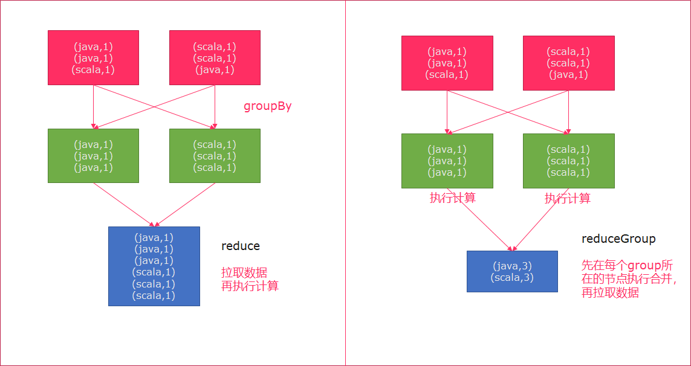
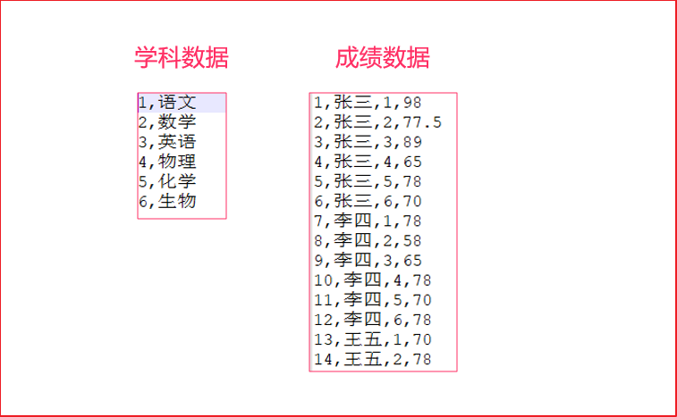
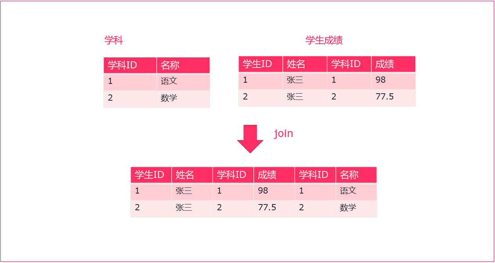
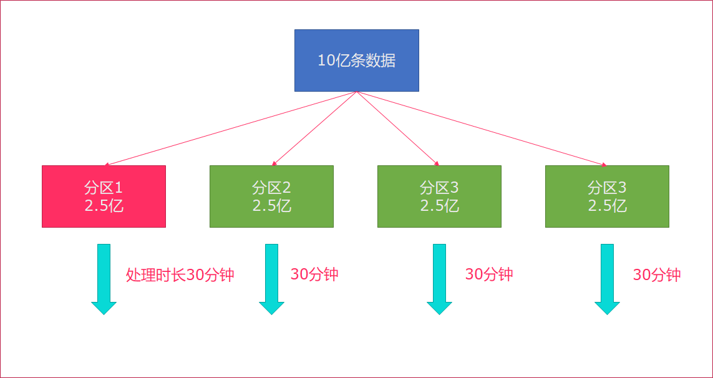

# Flink批处理

## 1. Flink批处理Transformation

| Transformation  | 说明                                                         |
| --------------- | ------------------------------------------------------------ |
| map             | 将DataSet中的每一个元素转换为另外一个元素                    |
| flatMap         | 将DataSet中的每一个元素转换为0...n个元素                     |
| mapPartition    | 将一个分区中的元素转换为另一个元素                           |
| filter          | 过滤出来一些符合条件的元素                                   |
| reduce          | 可以对一个dataset或者一个group来进行聚合计算，最终聚合成一个元素 |
| reduceGroup     | 将一个dataset或者一个group聚合成一个或多个元素               |
| aggregate       | 按照内置的方式来进行聚合。例如：SUM/MIN/MAX..                |
| distinct        | 去重                                                         |
| join            | 将两个DataSet按照一定条件连接到一起，形成新的DataSet         |
| union           | 将两个DataSet取并集，并不会去重                              |
| rebalance       | 让每个分区的数据均匀分布，避免数据倾斜                       |
| partitionByHash | 按照指定的key进行hash分区                                    |
| sortPartition   | 指定字段对分区中的数据进行排序                               |

### 1.1. map
---

将DataSet中的每一个元素转换为另外一个元素


**示例**

使用map操作，将以下数据

```html
"1,张三", "2,李四", "3,王五", "4,赵六"
```

转换为一个scala的样例类。


**步骤**

1. 获取`ExecutionEnvironment`运行环境
2. 使用`fromCollection`构建数据源
3. 创建一个`User`样例类
4. 使用`map`操作执行转换
5. 打印测试


**参考代码**


```scala
case class User(id:String, name:String)

val env = ExecutionEnvironment.getExecutionEnvironment

val textDataSet: DataSet[String] = env.fromCollection(
    List("1,张三", "2,李四", "3,王五", "4,赵六")
)

val userDataSet: DataSet[User] = textDataSet.map {
    text =>
    val fieldArr = text.split(",")
    User(fieldArr(0), fieldArr(1))
}

userDataSet.print()
```


### 1.2. flatMap

---

将DataSet中的每一个元素转换为0...n个元素


**示例**

分别将以下数据，转换成`国家`、`省份`、`城市`三个维度的数据。

将以下数据

```html
张三,中国,江西省,南昌市
李四,中国,河北省,石家庄市
Tom,America,NewYork,Manhattan
```

转换为

```html
(张三,中国)
(张三,中国,江西省)
(张三,中国,江西省,江西省)
(李四,中国)
(李四,中国,河北省)
(李四,中国,河北省,河北省)
(Tom,America)
(Tom,America,NewYork)
(Tom,America,NewYork,NewYork)
```


**思路**

* 以上数据为一条转换为三条，显然，应当使用`flatMap`来实现

* 分别在`flatMap`函数中构建三个数据，并放入到一个列表中

	姓名, 国家
	姓名, 国家省份
	姓名, 国家省份城市


​	


**步骤**

1. 构建批处理运行环境
2. 构建本地集合数据源
3. 使用`flatMap`将一条数据转换为三条数据

	* 使用逗号分隔字段
	* 分别构建国家、国家省份、国家省份城市三个元组
4. 打印输出


**参考代码**

```scala
// 1. 构建批处理运行环境
val env = ExecutionEnvironment.getExecutionEnvironment

// 2. 构建本地集合数据源
val userDataSet = env.fromCollection(List(
    "张三,中国,江西省,南昌市",
    "李四,中国,河北省,石家庄市",
    "Tom,America,NewYork,Manhattan"
))

// 3. 使用`flatMap`将一条数据转换为三条数据
val resultDataSet = userDataSet.flatMap{
    text =>
    //   - 使用逗号分隔字段
    val fieldArr = text.split(",")
    //   - 分别构建国家、国家省份、国家省份城市三个元组
    List(
        (fieldArr(0), fieldArr(1)), // 构建国家维度数据
        (fieldArr(0), fieldArr(1) + fieldArr(2)), // 构建省份维度数据
        (fieldArr(0), fieldArr(1) + fieldArr(2) + fieldArr(3)) // 构建城市维度数据
    )
}

// 4. 打印输出
resultDataSet.print()
```


### 1.3. mapPartition

---

将一个`分区`中的元素转换为另一个元素


**示例**

使用mapPartition操作，将以下数据

```html
"1,张三", "2,李四", "3,王五", "4,赵六"
```

转换为一个scala的样例类。


**步骤**

1. 获取`ExecutionEnvironment`运行环境
2. 使用`fromCollection`构建数据源
3. 创建一个`User`样例类
4. 使用`mapPartition`操作执行转换
5. 打印测试


**参考代码**

```scala
// 3. 创建一个`User`样例类
case class User(id:String, name:String)

def main(args: Array[String]): Unit = {
    // 1. 获取`ExecutionEnvironment`运行环境
    val env = ExecutionEnvironment.getExecutionEnvironment

    // 2. 使用`fromCollection`构建数据源
    val userDataSet = env.fromCollection(List("1,张三", "2,李四", "3,王五", "4,赵六"))

    // 4. 使用`mapPartition`操作执行转换
    val resultDataSet = userDataSet.mapPartition{
        iter =>
        // TODO:打开连接

        // 对迭代器执行转换操作
        iter.map{
            ele =>
            val fieldArr = ele.split(",")
            User(fieldArr(0), fieldArr(1))
        }

        // TODO：关闭连接
    }

    // 5. 打印测试
    resultDataSet.print()
}
```


> `map`和`mapPartition`的效果是一样的，但如果在map的函数中，需要访问一些外部存储。例如：
>
> `访问mysql数据库，需要打开连接`, 此时效率较低。而使用`mapPartition`可以有效减少连接数，提高效率

### 1.4. filter

---

`过滤出来`一些符合条件的元素


示例：

过滤出来以下以`h`开头的单词。

```html
"hadoop", "hive", "spark", "flink"
```


**步骤**

1. 获取`ExecutionEnvironment`运行环境
2. 使用`fromCollection`构建数据源
3. 使用`filter`操作执行过滤
4. 打印测试


**参考代码**

```scala
def main(args: Array[String]): Unit = {
    // 1. 获取`ExecutionEnvironment`运行环境
    val env = ExecutionEnvironment.getExecutionEnvironment

    // 2. 使用`fromCollection`构建数据源
    val wordDataSet = env.fromCollection(List("hadoop", "hive", "spark", "flink"))

    // 3. 使用`filter`操作执行过滤
    val resultDataSet = wordDataSet.filter(_.startsWith("h"))

    // 4. 打印测试
    resultDataSet.print()
  }
```


### 1.5. reduce

---

可以对一个`dataset`或者一个`group`来进行聚合计算，最终聚合成一个元素


**示例1**

请将以下元组数据，使用`reduce`操作聚合成一个最终结果

```html
("java" , 1) , ("java", 1) ,("java" , 1) 
```

将上传元素数据转换为`("java",3)`


**步骤**

1. 获取`ExecutionEnvironment`运行环境
2. 使用`fromCollection`构建数据源
3. 使用`redice`执行聚合操作
4. 打印测试


**参考代码**

```scala
// 1. 获取`ExecutionEnvironment`运行环境
val env = ExecutionEnvironment.getExecutionEnvironment

// 2. 使用`fromCollection`构建数据源
val wordCountDataSet = env.fromCollection(List(("java" , 1) , ("java", 1) ,("java" , 1) ))

// 3. 使用`redice`执行聚合操作
val resultDataSet = wordCountDataSet.reduce{
    (wc1, wc2) =>
    (wc2._1, wc1._2 + wc2._2)
}

// 4. 打印测试
resultDataSet.print()
```


---


**示例**2

请将以下元组数据，下按照单词使用`groupBy`进行分组，再使用`reduce`操作聚合成一个最终结果

```html
("java" , 1) , ("java", 1) ,("scala" , 1)  
```

转换为

```html
("java", 2), ("scala", 1)
```


**步骤**

1. 获取`ExecutionEnvironment`运行环境
2. 使用`fromCollection`构建数据源
3. 使用`groupBy`按照单词进行分组
4. 使用`reduce`对每个分组进行统计
5. 打印测试


**参考代码**

```scala
// 1. 获取`ExecutionEnvironment`运行环境
val env = ExecutionEnvironment.getExecutionEnvironment

// 2. 使用`fromCollection`构建数据源
val wordcountDataSet = env.fromCollection(List(("java" , 1) , ("java", 1) ,("scala" , 1)  ))

// 3. 使用`groupBy`按照单词进行分组
val groupedDataSet = wordcountDataSet.groupBy(_._1)

// 4. 使用`reduce`对每个分组进行统计
val resultDataSet = groupedDataSet.reduce{
    (wc1, wc2) =>
    (wc1._1, wc1._2 + wc2._2)
}

// 5. 打印测试
resultDataSet.print()
```


### 1.6. reduceGroup

---

  可以对一个dataset或者一个group来进行聚合计算，最终聚合成一个元素

reduce和reduceGroup的`区别`



* reduce是将数据一个个拉取到另外一个节点，然后再执行计算
* reduceGroup是先在每个group所在的节点上执行计算，然后再拉取


**示例**

请将以下元组数据，下按照单词使用`groupBy`进行分组，再使用`reduceGroup`操作进行单词计数

```html
("java" , 1) , ("java", 1) ,("scala" , 1)  
```


**步骤**

1. 获取`ExecutionEnvironment`运行环境
2. 使用`fromCollection`构建数据源
3. 使用`groupBy`按照单词进行分组
4. 使用`reduceGroup`对每个分组进行统计
5. 打印测试


**参考代码**

```scala
    // 1. 获取`ExecutionEnvironment`运行环境
    val env = ExecutionEnvironment.getExecutionEnvironment
    env.setParallelism(1)

    // 2. 使用`fromCollection`构建数据源
    val wordcountDataSet = env.fromCollection(
      List(("java" , 1) , ("java", 1) ,("scala" , 1)  )
    )

    // 3. 使用`groupBy`按照单词进行分组
    val groupedDataSet = wordcountDataSet.groupBy(_._1)

    // 4. 使用`reduceGroup`对每个分组进行统计
    val resultDataSet = groupedDataSet.reduceGroup{
      iter =>
        iter.reduce{(wc1, wc2) => (wc1._1,wc1._2 + wc2._2)}
    }

    // 5. 打印测试
    resultDataSet.print()
```


### 1.7. aggregate

---

按照内置的方式来进行聚合, Aggregate只能作用于`元组`上。例如：SUM/MIN/MAX..


**示例**

请将以下元组数据，使用`aggregate`操作进行单词统计

```html
("java" , 1) , ("java", 1) ,("scala" , 1)
```


**步骤**

1. 获取`ExecutionEnvironment`运行环境
2. 使用`fromCollection`构建数据源
3. 使用`groupBy`按照单词进行分组
4. 使用`aggregate`对每个分组进行`SUM`统计
5. 打印测试


**参考代码**

```scala
// 1. 获取`ExecutionEnvironment`运行环境
val env = ExecutionEnvironment.getExecutionEnvironment

// 2. 使用`fromCollection`构建数据源
val wordcountDataSet = env.fromCollection(
    List(("java" , 1) , ("java", 1) ,("scala" , 1)  )
)

// 3. 使用`groupBy`按照单词进行分组
val groupedDataSet = wordcountDataSet.groupBy(0)

// 4. 使用`aggregate`对每个分组进行`SUM`统计
val resultDataSet = groupedDataSet.aggregate(Aggregations.SUM, 1)

// 5. 打印测试
resultDataSet.print()
```


> **注意**
>
> 要使用aggregate，只能使用字段索引名或索引名称来进行分组`groupBy(0)`，否则会报一下错误:
>
> ```html
> Exception in thread "main" java.lang.UnsupportedOperationException: Aggregate does not support grouping with KeySelector functions, yet.
> ```


4.8. distinct

---

去除重复的数据


**示例**

请将以下元组数据，使用`distinct`操作去除重复的单词

```html
("java" , 1) , ("java", 2) ,("scala" , 1)
```

去重得到

```html
("java", 1), ("scala", 1)
```


**步骤**

1. 获取`ExecutionEnvironment`运行环境
2. 使用`fromCollection`构建数据源
3. 使用`distinct`指定按照哪个字段来进行去重
4. 打印测试


**参考代码**

```scala
// 1. 获取`ExecutionEnvironment`运行环境
val env = ExecutionEnvironment.getExecutionEnvironment

// 2. 使用`fromCollection`构建数据源
val wordcountDataSet = env.fromCollection(
    List(("java" , 1) , ("java", 1) ,("scala" , 1)  )
)

// 3. 使用`distinct`指定按照哪个字段来进行去重
val resultDataSet = wordcountDataSet.distinct(0)

// 4. 打印测试
resultDataSet.print()
```


### 1.8. join

---

使用join可以将两个DataSet连接起来


示例：

在`资料\测试数据源`中，有两个csv文件，有一个为`score.csv`，一个为`subject.csv`，分别保存了成绩数据以及学科数据。



需要将这两个数据连接到一起，然后打印出来。





**步骤**

1. 分别将资料中的两个文件复制到项目中的`data/join/input`中

2. 构建批处理环境

3. 创建两个样例类

   ```
   * 学科Subject（学科ID、学科名字）
   * 成绩Score（唯一ID、学生姓名、学科ID、分数——Double类型）
   ```

4. 分别使用`readCsvFile`加载csv数据源，并制定泛型
5. 使用join连接两个DataSet，并使用`where`、`equalTo`方法设置关联条件
6. 打印关联后的数据源


**参考代码**

```scala
// 学科Subject（学科ID、学科名字）
case class Subject(id:Int, name:String)

// 成绩Score（唯一ID、学生姓名、学科ID、分数）
case class Score(id:Int, name:String, subjectId:Int, score:Double)


def main(args: Array[String]): Unit = {
    // 1. 获取`ExecutionEnvironment`运行环境
    val env = ExecutionEnvironment.getExecutionEnvironment

    // 3. 分别使用`readCsvFile`加载csv数据源
    val scoreDataSet = env.readCsvFile[Score]("./data/join/input/score.csv")
    val subjectDataSet = env.readCsvFile[Subject]("./data/join/input/subject.csv")

    // 4. 使用join连接两个DataSet，并使用`where`、`equalTo`方法设置关联条件
    val joinedDataSet = scoreDataSet.join(subjectDataSet).where(2).equalTo(0)

    // 5. 打印关联后的数据源
    joinedDataSet.print()
}
```


### 1.9. union

---

将两个DataSet取并集，不会去重。


**示例**

将以下数据进行取并集操作

数据集1

```html
"hadoop", "hive", "flume"
```

数据集2

```html
"hadoop", "hive", "spark"
```


**步骤**

1. 构建批处理运行环境
2. 使用`fromCollection`创建两个数据源
3. 使用`union`将两个数据源关联在一起
4. 打印测试


**参考代码**

```scala
    // 1. 获取`ExecutionEnvironment`运行环境
    val env = ExecutionEnvironment.getExecutionEnvironment

    // 2. 使用`fromCollection`创建两个数据源
    val wordDataSet1 = env.fromCollection(List("hadoop", "hive", "flume"))
    val wordDataSet2 = env.fromCollection(List("hadoop", "hive", "spark"))

    // 3. 使用`union`将两个数据源关联在一起
    val resultDataSet = wordDataSet1.union(wordDataSet2)

    // 4. 打印测试
    resultDataSet.print()
```


### 1.10. rebalance

---

  Flink也会产生`数据倾斜`的时候，例如：当前的数据量有10亿条，在处理过程就有可能发生如下状况：


`rebalance`会使用轮询的方式将数据均匀打散，这是处理数据倾斜最好的选择。




**步骤**

1. 构建批处理运行环境

2. 使用`env.generateSequence`创建0-100的并行数据

3. 使用`fiter`过滤出来`大于8`的数字

4. 使用map操作传入`RichMapFunction`，将当前子任务的ID和数字构建成一个元组

   ```
   在RichMapFunction中可以使用`getRuntimeContext.getIndexOfThisSubtask`获取子任务序号
   ```

   

5. 打印测试


**参考代码**

```scala
    // 1. 获取`ExecutionEnvironment`运行环境
    val env = ExecutionEnvironment.getExecutionEnvironment

    // 2. 使用`env.generateSequence`创建0-100的并行数据
    val numDataSet = env.generateSequence(0, 100)

    // 3. 使用`fiter`过滤出来`大于8`的数字
    val filterDataSet = numDataSet.filter(_ > 8)

    // 4. 使用map操作传入`RichMapFunction`，将当前子任务的ID和数字构建成一个元组
    val resultDataSet = filterDataSet.map(new RichMapFunction[Long, (Long, Long)] {
      override def map(in: Long): (Long, Long) = {
        (getRuntimeContext.getIndexOfThisSubtask, in)
      }
    })

    // 5. 打印测试
    resultDataSet.print()
```


上述代码没有加rebalance，通过观察，有可能会出现数据倾斜。


在filter计算完后，调用`rebalance`，这样，就会均匀地将数据分布到每一个分区中。


### 1.11. hashPartition

---

按照指定的key进行hash分区


**示例**

基于以下列表数据来创建数据源，并按照hashPartition进行分区，然后输出到文件。

```html
List(1,1,1,1,1,1,1,2,2,2,2,2)
```


**步骤**

1. 构建批处理运行环境
2. 设置并行度为`2`
3. 使用`fromCollection`构建测试数据集
4. 使用`partitionByHash`按照字符串的hash进行分区
5. 调用`writeAsText`写入文件到`data/parition_output`目录中
6. 打印测试


**参考代码**

```scala
    // 1. 获取`ExecutionEnvironment`运行环境
    val env = ExecutionEnvironment.getExecutionEnvironment

    // 1. 设置并行度为`2`
    env.setParallelism(2)

    // 2. 使用`fromCollection`构建测试数据集
    val numDataSet = env.fromCollection(List(1,1,1,1,1,1,1,2,2,2,2,2))

    // 3. 使用`partitionByHash`按照字符串的hash进行分区
    val partitionDataSet: DataSet[Int] = numDataSet.partitionByHash(_.toString)

    // 4. 调用`writeAsText`写入文件到`data/parition_output`目录中
    partitionDataSet.writeAsText("./data/parition_output")

    // 5. 打印测试
    partitionDataSet.print()
```


### 1.12. sortPartition

---

指定字段对分区中的数据进行`排序`


**示例**

按照以下列表来创建数据集

```html
List("hadoop", "hadoop", "hadoop", "hive", "hive", "spark", "spark", "flink")
```

对分区进行排序后，输出到文件。


**步骤**

1. 构建批处理运行环境
2. 使用`fromCollection`构建测试数据集
3. 设置数据集的并行度为`2`
4. 使用`sortPartition`按照字符串进行降序排序
5. 调用`writeAsText`写入文件到`data/sort_output`目录中
6. 启动执行


**参考代码**

```scala
    // 1. 获取`ExecutionEnvironment`运行环境
    val env = ExecutionEnvironment.getExecutionEnvironment

    // 2. 使用`fromCollection`构建测试数据集
    val wordDataSet = env.fromCollection(List("hadoop", "hadoop", "hadoop", "hive", "hive", "spark", "spark", "flink"))

    // 3. 设置数据集的并行度为`2`
    wordDataSet.setParallelism(2)

    // 4. 使用`sortPartition`按照字符串进行降序排序
    val sortedDataSet = wordDataSet.sortPartition(_.toString, Order.DESCENDING)

    // 5. 调用`writeAsText`写入文件到`data/sort_output`目录中
    sortedDataSet.writeAsText("./data/sort_output/")

    // 6. 启动执行
    env.execute("App")
```


