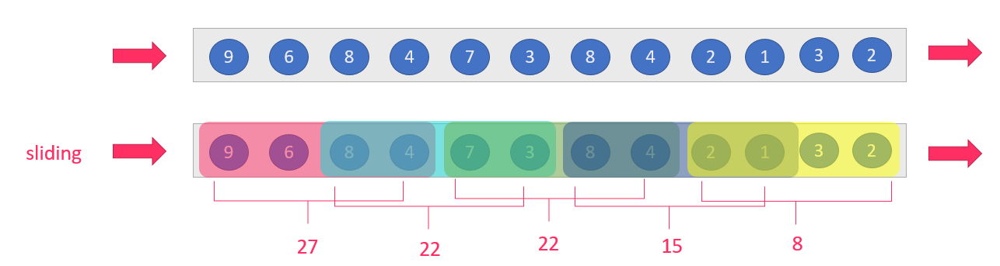

# Flink流处理


## 1. Flink的Window操作

Flink 认为 Batch 是 Streaming 的一个特例，所以 Flink 底层引擎是一个流式引擎，在上面实现了流处理和批处理。而窗口（window）就是从 Streaming 到 Batch 的一个桥梁。Flink 提供了非常完善的窗口机制。

### 1.1. 什么是window

在流处理应用中，数据是连续不断的，因此我们不可能等到所有数据都到了才开始处理。当然我们可以每来一个消息就处理一次，但是有时我们需要做一些聚合类的处理，例如：在过去的1分钟内有多少用户点击了我们的网页。在这种情况下，我们必须定义一个窗口，用来收集最近一分钟内的数据，并对这个窗口内的数据进行计算。

如果在数据流上，截取固定大小的一部分，这部分是可以进行统计的。 截取方式主要有两种:

>   1.  根据`时间`进行截取(time-driven-window)，比如每1分钟统计一次或每10分钟统计一次。
>   2.  根据`消息数量`进行截取(data-driven-window)，比如每5个数据统计一次或每50个数据统计一次。


### 1.2. 时间窗口


我们先提出一个问题：统计经过某红绿灯的汽车数量之和？ 
假设在一个红绿灯处，我们每隔15秒统计一次通过此红绿灯的汽车数量，如下图： 
 
可以把汽车的经过看成一个流，无穷的流，不断有汽车经过此红绿灯，因此无法统计总共的汽车数量。但是，我们可以换一种思路，每隔15秒，我们都将与上一次的结果进行sum操作（滑动聚合, 但是这个结果似乎还是无法回答我们的问题，根本原因在于流是无界的，我们不能限制流，但可以在有一个`有界`的范围内处理`无界`的流数据。

因此，我们需要换一个问题的提法：`每分钟经过某红绿灯的汽车数量之和？ `
这个问题，就相当于一个定义了一个Window（窗口），window的界限是1分钟，且每分钟内的数据互不干扰，因此也可以称为翻滚（不重合）窗口，如下图： 
 
第一分钟的数量为8，第二分钟是22，第三分钟是27。。。这样，1个小时内会有60个window。

再考虑一种情况，`每30秒统计一次过去1分钟的汽车数量之和`： 
 
此时，window出现了重合。这样，1个小时内会有120个window。


#### 1.2.1. tumbling-time-window (翻滚窗口-无重叠数据)

按照`时间`来进行窗口划分,每次窗口的`滑动距离`等于窗口的长度,这样数据不会重复计算,我们参考上面的案例

代码如下:

```scala
object StreamingTumblingTimeWindow {
  def main(args: Array[String]): Unit = {
    //1.创建运行环境
    val env: StreamExecutionEnvironment = StreamExecutionEnvironment.getExecutionEnvironment
    //2.定义数据流来源
    val textStream = env.socketTextStream("node01", 9999)
    //3.转换数据格式，text->CarWc
    val data = textStream.map(line => {
      val array = line.split(",")
      WordCountCart(array(0).toInt, array(1).toInt)
    })
    //4.执行统计操作，每个sensorId一个tumbling窗口，窗口的大小为5秒
    //也就是说，每5秒钟统计一次，在这过去的5秒钟内，各个路口通过红绿灯汽车的数量。
    val keyByData: KeyedStream[WordCountCart, Int] = data.keyBy(line => line.sen)
    //无重叠数据，所以只需要给一个参数即可，每5秒钟统计一下各个路口通过红绿灯汽车的数量
    val result = keyByData.timeWindow(Time.seconds(5)).sum(1)
    //5、显示统计结果
    result.print()
    //6、触发流计算
    env.execute()
  }
}

/**
  * @param sen     哪个红绿灯
  * @param cardNum 多少辆车
  */
case class WordCountCart(sen: Int, cardNum: Int)
```


#### 4.2.2. sliding-time-window (滑动窗口-有重叠数据)

按照时间来进行窗口划分,每次窗口的滑动距离小于窗口的长度,这样数据就会有一部分重复计算,我们参考上面的案例


代码如下:

```scala
import org.apache.flink.streaming.api.scala.{KeyedStream, StreamExecutionEnvironment}
import org.apache.flink.streaming.api.windowing.time.Time
import org.apache.flink.streaming.api.scala._
/**
  * 有重叠数据
  */
object StreamingTimeSlidingWindow {
  def main(args: Array[String]): Unit = {
    //1.创建运行环境
    val env: StreamExecutionEnvironment = StreamExecutionEnvironment.getExecutionEnvironment
    //2.定义数据流来源
    val textStream = env.socketTextStream("node01", 9000)
    //3.转换数据格式，text->CarWc
    val data = textStream.map(line => {
      val array = line.split(",")
      WordCountCart(array(0).toInt, array(1).toInt)
    })
    //4.执行统计操作，每个sensorId一个tumbling窗口，窗口的大小为5秒
    //也就是说，每2秒钟统计一次，在这过去的10秒钟内，各个路口通过红绿灯汽车的数量。
    val keyByData: KeyedStream[WordCountCart, Int] = data.keyBy(line => line.sen)
    val result = keyByData.timeWindow(Time.seconds(10), Time.seconds(2)).sum(1)
    //5、显示统计结果
    result.print()
    //6、触发流计算
    env.execute()
  }
}
```


#### 1.2.3. 小结

> 1. 如果窗口计算时间 > 窗口时间，会出现数据丢失
> 2. 如果窗口计算时间 < 窗口时间，会出现数据重复计算
> 3. 如果窗口计算时间 = 窗口时间，数据不会被重复计算


窗口计算时间 > 窗口时间


窗口计算时间 <  窗口时间


窗口计算时间 = 窗口时间


### 1.3. Count-Window

#### 1.3.1 tumbling-count-window (无重叠数据)

按照个数进行统计，比如：

每个路口分别统计，收到关于它的5条消息时,统计在最近5条消息中，各自路口通过的汽车数量

代码如下:

```scala
import org.apache.flink.streaming.api.scala.{KeyedStream, StreamExecutionEnvironment} 
import org.apache.flink.streaming.api.scala._
/**
  * 无重叠数据
  */
object StreamingCountTumblingWindow {
  def main(args: Array[String]): Unit = {
    //1.创建运行环境
    val env: StreamExecutionEnvironment = StreamExecutionEnvironment.getExecutionEnvironment
    //2.定义数据流来源
    val textStream = env.socketTextStream("node01", 9999)
    //3.转换数据格式，text->CountCart
    val data = textStream.map(line => {
      val array = line.split(",")
      CountCart(array(0).toInt, array(1).toInt)
    })
    //4.执行统计操作，每个sensorId一个tumbling窗口，窗口的大小为5秒
    //按照key进行收集，对应的key出现的次数达到5次作为一个结果
    val keyByData: KeyedStream[CountCart, Int] = data.keyBy(line => line.sen)
    //相同的key出现三次才做一次sum聚合
    val result = keyByData.countWindow(3).sum(1)
    //5、显示统计结果
    result.print()
    //6、触发流计算
    env.execute()
  }
}
case class CountCart(sen:Int, cardNum:Int)
```


#### 1.3.2 sliding-count-window (有重叠数据)

同样也是窗口长度和滑动窗口的操作：窗口长度是5，滑动长度是3

```scala
import org.apache.flink.streaming.api.scala.{KeyedStream, StreamExecutionEnvironment}
import org.apache.flink.streaming.api.windowing.time.Time
import org.apache.flink.streaming.api.scala._
/**
  * 有重叠数据
  */
object StreamingCountSlidingWindow {
  def main(args: Array[String]): Unit = {
    //1.创建运行环境
    val env: StreamExecutionEnvironment = StreamExecutionEnvironment.getExecutionEnvironment
    //2.定义数据流来源
    val textStream = env.socketTextStream("node01", 9000)
    //3.转换数据格式，text->CarWc
    val data = textStream.map(line => {
      val array = line.split(",")
      CountCart(array(0).toInt, array(1).toInt)
    })
    //4.执行统计操作，每个sensorId一个sliding窗口，窗口大小3条数据,窗口滑动为3条数据
    //也就是说，每个路口分别统计，收到关于它的3条消息时统计在最近5条消息中，各自路口通过的汽车数量
    val keyByData: KeyedStream[CountCart, Int] = data.keyBy(line => line.sen)
    val result = keyByData.countWindow(5, 3).sum(1)
    //5、显示统计结果
    result.print()
    //6、触发流计算
    env.execute()
  }
}
```


### 1.4. Window apply

apply方法可以进行一些自定义处理，通过匿名内部类的方法来实现。当有一些复杂计算时使用。


**用法**

1. 实现`WindowFunction`类
2. 指定该类的泛型为`[输入数据类型, 输出数据类型, keyBy中使用分组字段的类型, 窗口类型]`


**示例**

使用apply方法来实现单词统计

**步骤**

1. 获取流处理运行环境
2. 构建socket流数据源，并指定IP地址和端口号
3. 对接收到的数据转换成单词元组
4. 使用`keyBy`进行分流（分组）
5. 使用`timeWinodw`指定窗口的长度（每3秒计算一次）
6. 实现一个WindowFunction匿名内部类
   - 在apply方法中实现聚合计算
   - 使用Collector.collect收集数据
7. 打印输出
8. 启动执行
9. 在Linux中，使用`nc -lk 端口号`监听端口，并发送单词


**参考代码**

```scala

import org.apache.flink.streaming.api.scala.{DataStream, StreamExecutionEnvironment}
import org.apache.flink.api.scala._
import org.apache.flink.streaming.api.scala.function.WindowFunction
import org.apache.flink.streaming.api.windowing.time.Time
import org.apache.flink.streaming.api.windowing.windows.TimeWindow
import org.apache.flink.util.Collector

object WindowApply {

  def main(args: Array[String]): Unit = {
    // 1. 获取流处理运行环境
    val env = StreamExecutionEnvironment.getExecutionEnvironment

    // 2. 构建socket流数据源，并指定IP地址和端口号
    val socketDataStream = env.socketTextStream("node01", 9999)

    // 3. 对接收到的数据转换成单词元组
    val wordcountDataStream: DataStream[(String, Int)] = socketDataStream.flatMap {
      text =>
        text.split(" ").map(_ -> 1)
    }

    // 4. 使用`keyBy`进行分流（分组）
    val groupedDataStream = wordcountDataStream.keyBy(_._1)

    // 5. 使用`timeWinodw`指定窗口的长度（每3秒计算一次）
    val windowedDataStream = groupedDataStream.timeWindow(Time.seconds(3))

    // 6. 实现一个WindowFunction匿名内部类
    val resultDataStream: DataStream[(String, Int)] = windowedDataStream.apply(new WindowFunction[(String, Int), (String, Int), String, TimeWindow] {

      //   - 在apply方法中实现聚合计算
      override def apply(key: String, window: TimeWindow, input: Iterable[(String, Int)], out: Collector[(String, Int)]): Unit = {
        val resultWordCount: (String, Int) = input.reduce {
          (wc1, wc2) =>
            (wc1._1, wc1._2 + wc2._2)
        }
        //   - 使用Collector.collect收集数据
        out.collect(resultWordCount)
      }
    })

    // 7. 打印输出
    resultDataStream.print()

    // 8. 启动执行
    env.execute("App")

  }
}

```


