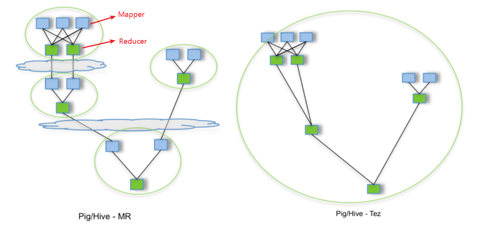

# Flink基础介绍

## 1. Flink介绍

### 1.1. Flink引入

​	这几年大数据的飞速发展，出现了很多热门的开源社区，其中著名的有`Hadoop`、`Storm`，以及后来的 `Spark`，他们都有着各自专注的应用场景。`Spark`掀开了`内存计算`的先河，也以内存为赌注，赢得了内存计算的飞速发展。Spark 的火热或多或少的掩盖了其他分布式计算的系统身影。就像 Flink，也就在这个时候默默的发展着。

​	在国外一些社区，有很多人将大数据的计算引擎分成了` 4 代`，当然也有很多人不会认同。我们先姑且这么认为和讨论。

**第1代——Hadoop MapReduce**

- 批处理

- Mapper、Reducer

  > Hadoop的MapReduce将计算分为两个阶段，分别为 Map 和 Reduce。对于上层应用来说，就不得不想方设法去拆分算法，甚至于不得不在上层应用实现多个Job的串联，以完成一个完整的算法，例如迭代计算。

**第2代——DAG框架（`Tez`） + MapReduce**

- 批处理

- 1个Tez = MR(1) + MR(2) + ... + MR(n)

- 相比MR效率有所提升

  

**第3代——Spark**

- 批处理、流处理、SQL高层API支持
- 自带DAG
- 内存迭代计算、性能较之前大幅提升

**第4代——Flink**

- 批处理、流处理、SQL高层API支持
- 自带DAG
- 流式计算性能更高、可靠性更高

### 1.2. 什么是Flink

**Flink概述:**

- 分布式的`计算引擎`
- 支持`批处理`，即处理静态的数据集、历史的数据集
- 支持`流处理`，即实时地处理一些实时数据流
- 支持`基于事件`的应用【比如说滴滴通过`Flink CEP`实现实时监测司机的行为流来判断司机的行为是否正当】

**官网地址**:  https://flink.apache.org/

**官网介绍:** 

​	

`Stateful Computations over Data Streams`，即数据流上的有状态的计算。

- **Data Streams** ，Flink认为`有界数据集`是`无界数据流`的一种特例，所以说有界数据集也是一种数据流，事件流也是一种数据流。`Everything is streams`，即Flink可以用来处理任何的数据，可以支持批处理、流处理、AI、MachineLearning等等。

- **Stateful Computations**，即`有状态计算`。有状态计算是最近几年来越来越被用户需求的一个功能。比如说一个网站一天内访问UV数，那么这个UV数便为`状态`。Flink提供了内置的对状态的一致性的处理，即如果任务发生了Failover，其状态不会丢失、不会被多算少算，同时提供了非常高的性能。

> `无界流`：意思很明显，只有开始没有结束。必须连续的处理无界流数据，也即是在事件注入之后立即要对其进行处理。不能等待数据到达了再去全部处理，因为数据是无界的并且永远不会结束数据注入。处理无界流数据往往要求事件注入的时候有一定的顺序性，例如可以以事件产生的顺序注入，这样会使得处理结果完整。

> `有界流`：也即是有明确的开始和结束的定义。有界流可以等待数据全部注入完成了再开始处理。注入的顺序不是必须的了，因为对于一个静态的数据集，我们是可以对其进行排序的。有界流的处理也可以称为`批处理`。

**其它特点:**

- 性能优秀(尤其在流计算领域)
- 高可扩展性
- 支持容错
- `纯内存式`的计算引擎，做了内存管理方面的大量优化
- 支持`eventime`的处理
- 支持超大状态的Job(在阿里巴巴中作业的state大小超过TB的是非常常见的)
- 支持`exactly-once`的处理。

### 1.3. 性能比较

首先，我们可以通过下面的性能测试初步了解两个框架的性能区别，它们都可以基于内存计算框架进行实时计算，所以都拥有非常好的计算性能。经过测试，Flink计算性能上略好。

**测试环境：** 

> 1.CPU：7000个； 
> 2.内存：单机128GB； 
> 3.版本：Hadoop 2.3.0，Spark 1.4，Flink 0.9 
> 4.数据：800MB，8GB，8TB； 
> 5.算法：K-means：以空间中K个点为中心进行聚类，对最靠近它们的对象归类。通过迭代的方法，逐次更新各聚类中心的值，直至得到最好的聚类结果。 
> 6.迭代：K=10，3组数据 

**测试结果:**

​	纵坐标是秒，横坐标是次数	

**结论:** 

Spark和Flink全部都运行在Hadoop YARN上，性能为Flink > Spark > Hadoop(MR)，迭代次数越多越明显

性能上，Flink优于Spark和Hadoop最主要的原因是Flink支持`增量迭代`，具有`对迭代自动优化`的功能

### 1.4. 发展历史

2008年，Flink 的前身已经是柏林理工大学一个研究性项目，原名 `StratoSphere`。

2014年，Flink被` Apache孵化器`所接受然后迅速地成为了 `ASF（Apache Software Foundation）`的顶级项目之一。

最新版本已经到了`1.8.0`

本次课程基于`flink-1.6.1`开发

> spark是2009年诞生在`加州大学伯克利分校的AMP实验室`，2013年开源成为Apache孵化项目

### 1.5. Flink在阿里的现状

基于Apache Flink在阿里巴巴搭建的平台于2016年正式上线，并从阿里巴巴的`搜索`和`推荐`这两大场景开始实现。

目前阿里巴巴所有的业务，包括阿里巴巴所有子公司都采用了基于Flink搭建的实时计算平台。

同时Flink计算平台运行在开源的Hadoop集群之上。

采用Hadoop的`YARN`做为资源管理调度，以 `HDFS`作为数据存储。

因此，Flink可以和开源大数据软件Hadoop无缝对接。

目前，这套基于Flink搭建的实时计算平台不仅服务于阿里巴巴集团内部，而且通过阿里云的云产品API向整个开发者生态提供基于Flink的云产品支持。

**Flink在阿里巴巴的大规模应用，表现如何？**

- 规模：一个系统是否成熟，规模是重要指标，Flink最初上线阿里巴巴只有数百台服务器，目前规模已达上万台，此等规模在全球范围内也是屈指可数；
- 状态数据：基于Flink，内部积累起来的状态数据已经是PB级别规模；
- Events：如今每天在Flink的计算平台上，处理的数据已经超过万亿条;
- TPS：在峰值期间可以承担每秒超过4.72亿次的访问，最典型的应用场景是`阿里巴巴双11大屏`；

**Flink分支`Blink`**

- 阿里自15年起开始调研开源流计算引擎，最终决定基于Flink打造新一代计算引擎
- 阿里贡献了数百个commiter，并对Flink进行高度定制，并取名为`Blink`
- 阿里是`Flink SQL`的最大贡献者，一半以上的功能都是阿里的工程师开发的

**logo介绍**

在德语中，flink 一词表示快速和灵巧 , 松鼠具有快速和灵巧的特点

柏林的松鼠是红棕色，Flink的松鼠 logo尾巴的颜色与 Apache 软件基金会的 logo 颜色相呼应

