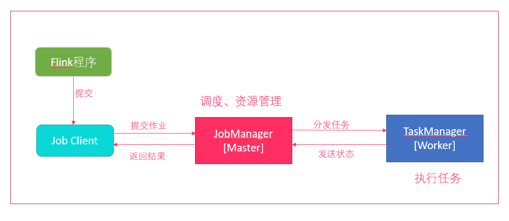
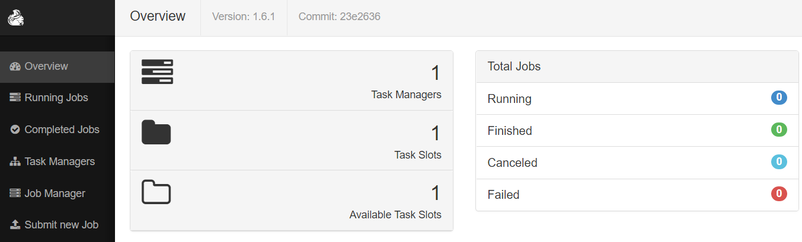
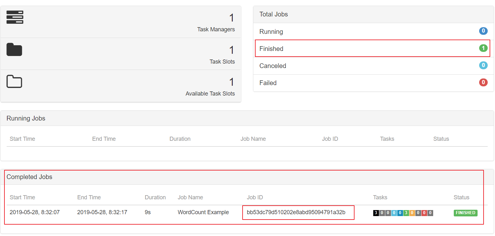
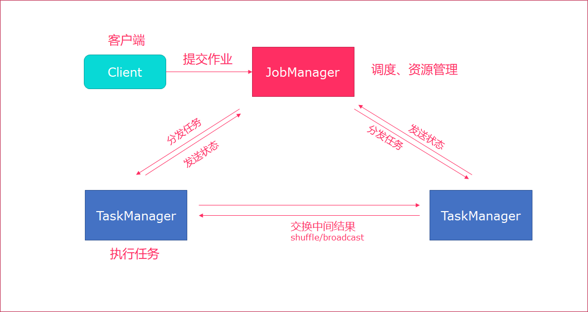

# Flink基础介绍

------

## 2. Flink集群安装

Flink支持多种安装模式

- local（本地）——单机模式，一般不使用
- standalone——独立模式，Flink自带集群，开发测试环境使用
- yarn——计算资源统一由Hadoop YARN管理，生产测试环境使用


### 2.1. 伪分布环境部署




- Flink程序需要提交给`Job Client`
- Job Client将作业提交给`Job Manager`
- Job Manager负责协调资源分配和作业执行。 资源分配完成后，任务将提交给相应的`Task Manager`
- Task Manager启动一个线程以开始执行。Task Manager会向Job Manager报告状态更改。例如开始执行，正在进行或已完成。 
- 作业执行完成后，结果将发送回客户端（Job Client）


**环境准备:**

- 下载安装包 https://archive.apache.org/dist/flink/flink-1.6.1/flink-1.6.1-bin-hadoop27-scala_2.11.tgz
- 服务器: node01 (192.168.100.100)


**安装步骤：**

1. 上传压缩包

2. 解压 

   ```shell
   tar -zxvf flink-1.6.1-bin-hadoop27-scala_2.11.tgz -C /export/servers/
   ```

   

3. 启动

   ```shell
   cd /export/servers/flink-1.6.1
   ./bin/start-cluster.sh 
   ```

   

   > **使用JPS可以查看到下面两个进程**
   >
   > - TaskManagerRunner
   >
   > - StandaloneSessionClusterEntrypoint


4. 访问web界面

   ```shell
   http://node01:8081
   ```

   

   > `slot`在flink里面可以认为是资源组，Flink是通过将任务分成子任务并且将这些子任务分配到slot来并行执行程序。

5. 运行测试任务

   ```shell
   bin/flink run /export/servers/flink-1.6.1/examples/batch/WordCount.jar --input /export/servers/zookeeper-3.4.9/zookeeper.out --output /export/servers/flink_data
   ```

   > **控制台输出:** 
   >
   > Starting execution of program
   >
   > Program execution finished
   >
   > Job with JobID bb53dc79d510202e8abd95094791a32b has finished.
   >
   > Job Runtime: 9539 ms

   

   **观察WebUI**

   


### 2.2. Standalone模式集群安装部署


**Standalone集群架构**





- client客户端提交任务给JobManager
- JobManager负责Flink集群计算资源管理，并分发任务给TaskManager执行
- TaskManager定期向JobManager汇报状态


**环境准备:**

- 服务器: node01(Master + Slave)
- 服务器: node02(Slave)
- 服务器: node03(Slave)


**安装步骤:**

1. 上传flink压缩包到指定目录

2. 解压缩flink到`/export/servers`目录

   ```
   tar -xvzf flink-1.6.1-bin-hadoop27-scala_2.11.tgz -C /export/servers/
   ```

   

3. 使用vi修改`conf/flink-conf.yaml`

   ```shell
   # jobManager 的IP地址
   jobmanager.rpc.address: node01
   
   # JobManager 的端口号
   jobmanager.rpc.port: 6123
   
   # JobManager JVM heap 内存大小
   jobmanager.heap.size: 1024
   
   # TaskManager JVM heap 内存大小
   taskmanager.heap.size: 1024
   
   # 每个 TaskManager 提供的任务 slots 数量大小
   taskmanager.numberOfTaskSlots: 2
   
   #是否进行预分配内存，默认不进行预分配，这样在我们不使用flink集群时候不会占用集群资源
   taskmanager.memory.preallocate: false
   
   # 程序默认并行计算的个数
   parallelism.default: 1
   
   #JobManager的Web界面的端口（默认：8081）
   jobmanager.web.port: 8081
   
   #配置每个taskmanager生成的临时文件目录（选配）
   taskmanager.tmp.dirs: /export/servers/flink-1.6.1/tmp
   ```

   

   > **slot和parallelism总结**
   >
   > taskmanager.numberOfTaskSlots:2
   >
   > 每一个taskmanager中的分配2个TaskSlot,3个taskmanager一共有6个TaskSlot
   >
   > parallelism.default:1 
   > 运行程序默认的并行度为1，6个TaskSlot只用了1个，有5个空闲
   >
   > 1.	`slot`是静态的概念，是指`taskmanager`具有的并发执行能力
   > 2.	`parallelism`是动态的概念，是指程序运行时实际使用的并发能力

   

4. 使用vi修改slaves文件

   ```
   node01
   node02
   node03
   ```

   

5. 使用vi修改`/etc/profile`系统环境变量配置文件，添加HADOOP_CONF_DIR目录

   ```
   export HADOOP_CONF_DIR=/export/servers/hadoop-2.7.5/etc/hadoop
   ```

   

6. 分发/etc/profile到其他两个节点

   ```shell
   scp -r /etc/profile node02:/etc
   scp -r /etc/profile node03:/etc
   ```

   

7. 每个节点重新加载环境变量

   ```shell
   source /etc/profile
   ```

   

8. 使用scp命令分发flink到其他节点

   ```shell
   scp -r /export/servers/flink-1.6.1/ node02:/export/servers/
   scp -r /export/servers/flink-1.6.1/ node03:/export/servers/
   ```

   

9. 启动Flink集群

   ```
   ./bin/start-cluster.sh
   ```

   > **启动/停止flink集群**
   >
   > - 启动：./bin/start-cluster.sh  
   >
   > - 停止：./bin/stop-cluster.sh
   >
   >   
   >
   > **启动/停止jobmanager**
   > 如果集群中的jobmanager进程挂了，执行下面命令启动
   >
   > - bin/jobmanager.sh start
   >
   > - bin/jobmanager.sh stop
   >
   >   
   >
   > **启动/停止taskmanager**
   > 添加新的taskmanager节点或者重启taskmanager节点
   >
   > - bin/taskmanager.sh start
   > - bin/taskmanager.sh stop

10. 启动HDFS集群

    ```shell
    cd /export/servers/hadoop-2.7.5/sbin
    start-all.sh
    ```

    

11. 在HDFS中创建/test/input目录

    ```shell
    hdfs dfs -mkdir -p /test/input
    ```

    

12. 上传wordcount.txt文件到HDFS /test/input目录

    ```shell
    hdfs dfs -put /export/servers/flink-1.6.1/README.txt /test/input
    ```

    

13. 并运行测试任务

    ```shell
    bin/flink run /export/servers/flink-1.6.1/examples/batch/WordCount.jar --input hdfs://node01:8020/test/input/README.txt --output hdfs://node01:8020/test/output2/result.txt
    ```

    

14. 浏览Flink Web UI界面

    ```
    http://node01:8081
    ```

    

### 2.3. Standalone高可用HA模式

------

从上述架构图中，可发现JobManager存在`单点故障`，一旦JobManager出现意外，整个集群无法工作。所以，为了确保集群的高可用，需要搭建Flink的HA。

**HA架构图**


**环境准备:**

- 服务器: node01(Master + Slave)
- 服务器: node02(Master + Slave)
- 服务器: node03(Slave)


**安装步骤**

1. 在flink-conf.yaml中添加zookeeper配置

   ```yaml
   #开启HA，使用文件系统作为快照存储
   state.backend: filesystem
   #启用检查点，可以将快照保存到HDFS
   state.backend.fs.checkpointdir: hdfs://node01:8020/flink-checkpoints
   #使用zookeeper搭建高可用
   high-availability: zookeeper
   # 存储JobManager的元数据到HDFS
   high-availability.storageDir: hdfs://node01:8020/flink/ha/
   high-availability.zookeeper.quorum: node01:2181,node02:2181,node03:2181
   ```

   

2. 将配置过的HA的`flink-conf.yaml`分发到另外两个节点

   ```shell
   scp -r /export/servers/flink-1.6.1/conf/flink-conf.yaml node02:/export/servers/flink-1.6.1/conf/
   scp -r /export/servers/flink-1.6.1/conf/flink-conf.yaml node03:/export/servers/flink-1.6.1/conf/
   ```

   

3. 到节点2中修改flink-conf.yaml中的配置，将JobManager设置为自己节点的名称

   ```yaml
   jobmanager.rpc.address: node02
   ```

   

4. 在node01的`masters`配置文件中添加多个节点

   ```html
   node01:8081
   node02:8081
   ```

   

5. 分发masters配置文件到另外两个节点

   ```shell
   scp /export/servers/flink-1.6.1/conf/masters node02:/export/servers/flink-1.6.1/conf/
   scp /export/servers/flink-1.6.1/conf/masters node03:/export/servers/flink-1.6.1/conf/
   ```

   

6. 启动`zookeeper`集群

7. 启动`HDFS`集群

8. 启动`flink`集群

9. 分别查看两个节点的Flink Web UI

10. kill掉一个节点，查看另外的一个节点的Web UI


> 注意事项
>
> 切记搭建HA，需要将第二个节点的`jobmanager.rpc.address`修改为node02


### 2.4. Yarn集群环境

在一个企业中，为了最大化的利用集群资源，一般都会在一个集群中同时运行多种类型的 Workload。因此 Flink 也支持在`Yarn`上面运行；`flink on yarn`的前提是：hdfs、yarn均启动


**集群规划**

JobManager: node01

WorkManager: node01 node02 node03


**步骤**

1. 修改Hadoop的yarn-site.xml，添加该配置表示内存超过分配值，是否将任务杀掉。默认为true。

   运行Flink程序，很容易超过分配的内存。

   ```xml
   <property>
   	<name>yarn.nodemanager.vmem-check-enabled</name>
       <value>false</value>
   </property>
   ```

2. 分发yarn-site.xml到其它服务器节点

   ```shell
   scp yarn-site.xml node02:$PWD
   scp yarn-site.xml node03:$PWD
   ```

   

3. 启动HDFS、YARN集群

   ```shell
   start-all.sh
   ```

   


### 2.5. yarn-session

Flink运行在YARN上，可以使用`yarn-session`来快速提交作业到YARN集群。我们先来看下Flink On Yarn模式，Flink是如何和Yarn进行交互的。


1. 上传jar包和配置文件到HDFS集群上

2. 申请资源和请求AppMaster容器

3. Yarn分配资源AppMaster容器，并启动JobManager

   ```
   JobManager和ApplicationMaster运行在同一个container上。
   一旦他们被成功启动，AppMaster就知道JobManager的地址（AM它自己所在的机器）。
   它就会为TaskManager生成一个新的Flink配置文件（他们就可以连接到JobManager）。
   这个配置文件也被上传到HDFS上。
   此外，AppMaster容器也提供了Flink的web服务接口。
   YARN所分配的所有端口都是临时端口，这允许用户并行执行多个Flink
   ```

4. 申请worker资源，启动TaskManager


yarn-session提供两种模式: `会话模式`和`分离模式`


### 2.6. 会话模式

- 使用Flink中的yarn-session（yarn客户端），会启动两个必要服务`JobManager`和`TaskManager`
- 客户端通过yarn-session提交作业
- yarn-session会一直启动，不停地接收客户端提交的作用
- 有大量的小作业，适合使用这种方式


​	


**使用步骤:** 

1. 在flink目录启动yarn-session

   ```shell
   bin/yarn-session.sh -n 2 -tm 800 -s 1 -d
   
   # -n 表示申请2个容器，
   # -s 表示每个容器启动多少个slot
   # -tm 表示每个TaskManager申请800M内存
   # -d 表示以后台程序方式运行
   
   yarn-session.sh脚本可以携带的参数:
      Required
        -n,--container <arg>               分配多少个yarn容器 (=taskmanager的数量)  
      Optional
        -D <arg>                        动态属性
        -d,--detached                    独立运行 （以分离模式运行作业）
        -id,--applicationId <arg>            YARN集群上的任务id，附着到一个后台运行的yarn session中
        -j,--jar <arg>                      Path to Flink jar file
        -jm,--jobManagerMemory <arg>     JobManager的内存 [in MB] 
        -m,--jobmanager <host:port>        指定需要连接的jobmanager(主节点)地址  
                                       使用这个参数可以指定一个不同于配置文件中的jobmanager  
        -n,--container <arg>               分配多少个yarn容器 (=taskmanager的数量) 
        -nm,--name <arg>                 在YARN上为一个自定义的应用设置一个名字
        -q,--query                        显示yarn中可用的资源 (内存, cpu核数) 
        -qu,--queue <arg>                 指定YARN队列
        -s,--slots <arg>                   每个TaskManager使用的slots数量
        -st,--streaming                   在流模式下启动Flink
        -tm,--taskManagerMemory <arg>    每个TaskManager的内存 [in MB] 
        -z,--zookeeperNamespace <arg>     针对HA模式在zookeeper上创建NameSpace
   
   ```

2. 使用flink提交任务

   ```shell
   bin/flink run examples/batch/WordCount.jar
   ```

3. 如果程序运行完了，可以使用`yarn application -kill application_id`杀掉任务

   ```shell
   yarn application -kill application_1554377097889_0002
   ```

   


### 2.7. 分离模式

- 直接提交任务给YARN
- 大作业，适合使用这种方式


1. 使用flink直接提交任务

   ```shell
   bin/flink run -m yarn-cluster -yn 2 ./examples/batch/WordCount.jar  
   
   # -m  jobmanager的地址
   # -yn 表示TaskManager的个数  
   ```

2. 查看WEB UI


