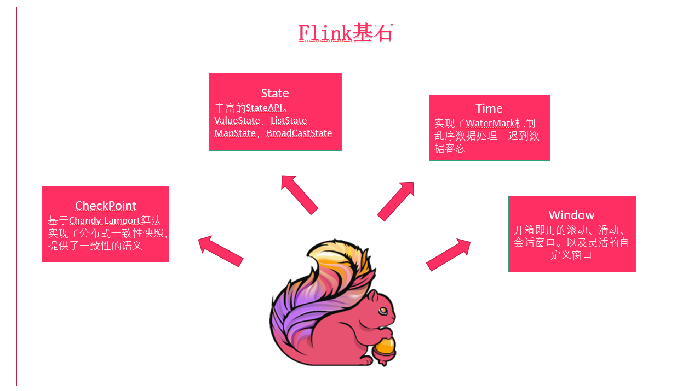
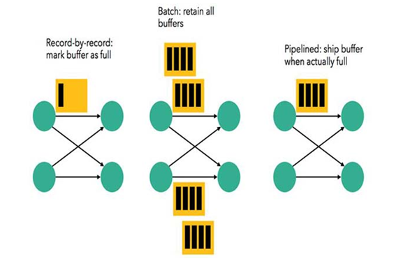
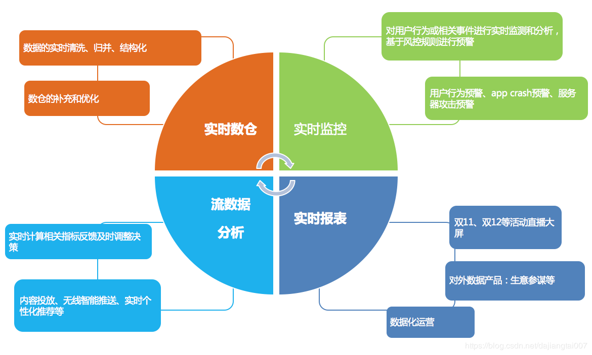

# Flink基础介绍

------

## 3. Flink架构介绍


### 3.1. Flink基石

Flink之所以能这么流行，离不开它最重要的四个基石：`Checkpoint`、`State`、`Time`、`Window`。





首先是`Checkpoint`机制，这是Flink最重要的一个特性。Flink基于`Chandy-Lamport`算法实现了一个分布式的一致性的快照，从而提供了`一致性的语义`。Chandy-Lamport算法实际上在1985年的时候已经被提出来，但并没有被很广泛的应用，而Flink则把这个算法发扬光大了。Spark最近在实现Continue streaming，Continue streaming的目的是为了降低它处理的延时，其也需要提供这种一致性的语义，最终采用Chandy-Lamport这个算法，说明Chandy-Lamport算法在业界得到了一定的肯定。

提供了一致性的语义之后，Flink为了让用户在编程时能够更轻松、更容易地去`管理状态`，还提供了一套非常简单明了的State API，包括里面的有ValueState、ListState、MapState，近期添加了BroadcastState，使用State API能够自动享受到这种一致性的语义。

除此之外，Flink还实现了`Watermark`的机制，能够支持基于`事件的时间`的处理，或者说基于系统时间的处理，能够容忍数据的`迟到`、容忍`乱序`的数据。

另外流计算中一般在对流数据进行操作之前都会先进行开窗，即基于一个什么样的窗口上做这个计算。Flink提供了开箱即用的各种窗口，比如`滑动窗口`、`滚动窗口`、`会话窗口`以及非常灵活的`自定义的窗口`。


### 3.2. 组件栈

Flink是一个分层架构的系统，每一层所包含的组件都提供了特定的抽象，用来服务于上层组件。Flink分层的组件栈如下图所示：


从下至上：

- 部署层：Flink 支持本地运行、能在独立集群或者在被 YARN 管理的集群上运行， 也能部署在云上。
- 运行时：Runtime层提供了支持Flink计算的全部核心实现，为上层API层提供基础服务。
- API：DataStream、DataSet、Table、SQL API。
- 扩展库：Flink 还包括用于复杂事件处理，机器学习，图形处理和 Apache Storm 兼容性的专用代码库。


### 3.3. Flink数据流编程模型抽象级别

Flink 提供了不同的抽象级别以开发流式或批处理应用。


- 最底层提供了有状态流。它将通过 过程函数（Process Function）嵌入到 DataStream API 中。它允许用户可以自由地处理来自一个或多个流数据的事件，并使用一致、容错的状态。除此之外，用户可以注册事件时间和处理事件回调，从而使程序可以实现复杂的计算。

- DataStream / DataSet API 是 Flink 提供的核心 API ，DataSet 处理有界的数据集，DataStream 处理有界或者无界的数据流。用户可以通过各种方法（map / flatmap / window / keyby / sum / max / min / avg / join 等）将数据进行转换 / 计算。


- Table API 是以 表 为中心的声明式 DSL，其中表可能会动态变化（在表达流数据时）。Table API 提供了例如 select、project、join、group-by、aggregate 等操作，使用起来却更加简洁（代码量更少）。你可以在表与 DataStream/DataSet 之间无缝切换，也允许程序将 Table API 与 DataStream 以及 DataSet 混合使用。


- Flink 提供的最高层级的抽象是 SQL 。这一层抽象在语法与表达能力上与 Table API 类似，但是是以 SQL查询表达式的形式表现程序。SQL 抽象与 Table API 交互密切，同时 SQL 查询可以直接在 Table API 定义的表上执行。


### 3.4. Flink程序结构

Flink程序的基本构建块是**流**和**转换**（请注意，Flink的DataSet API中使用的DataSet也是内部流 ）。从概念上讲，流是（可能永无止境的）数据记录流，而转换是将一个或多个流作为一个或多个流的操作。输入，并产生一个或多个输出流。


Flink 应用程序结构就是如上图所示：

`Source`: 数据源，Flink 在流处理和批处理上的 source 大概有 4 类：基于本地集合的 source、基于文件的 source、基于网络套接字的 source、自定义的 source。自定义的 source 常见的有 Apache kafka、RabbitMQ 等，当然你也可以定义自己的 source。

`Transformation`：数据转换的各种操作，有 Map / FlatMap / Filter / KeyBy / Reduce / Fold / Aggregations / Window / WindowAll / Union / Window join / Split / Select等，操作很多，可以将数据转换计算成你想要的数据。

`Sink`：接收器，Flink 将转换计算后的数据发送的地点 ，你可能需要存储下来，Flink 常见的 Sink 大概有如下几类：写入文件、打印出来、写入 socket 、自定义的 sink 。自定义的 sink 常见的有 Apache kafka、RabbitMQ、MySQL、ElasticSearch、Apache Cassandra、Hadoop FileSystem 等，同理你也可以定义自己的 sink。

 

### 3.5. Flink并行数据流

Flink程序在执行的时候，会被映射成一个`Streaming Dataflow`，一个Streaming Dataflow是由一组`Stream`和`Transformation Operator`组成的。在启动时从一个或多个`Source Operator`开始，结束于一个或多个`Sink Operator`。

Flink程序本质上是`并行的和分布式`的，在执行过程中，一个流(stream)包含一个或多个流`分区`，而每一个operator包含一个或多个operator子任务。操作子任务间彼此独立，在不同的线程中执行，甚至是在不同的机器或不同的容器上。operator子任务的数量是这一特定operator的`并行度`。相同程序中的不同operator有不同级别的并行度。


一个Stream可以被分成多个Stream的分区，也就是`Stream Partition`。一个Operator也可以被分为`多个Operator Subtask`。如上图中，Source被分成Source1和Source2，它们分别为Source的Operator Subtask。每一个Operator Subtask都是在`不同的线程`当中独立执行的。一个Operator的并行度，就等于Operator Subtask的个数。上图Source的并行度为2。而一个Stream的并行度就等于它生成的Operator的并行度。

数据在两个operator之间传递的时候有两种模式：

One to One模式：两个operator用此模式传递的时候，会保持数据的分区数和数据的排序；如上图中的Source1到Map1，它就保留的Source的分区特性，以及分区元素处理的有序性。

Redistributing （重新分配）模式：这种模式会改变数据的分区数；每个一个operator subtask会根据选择transformation把数据发送到不同的目标subtasks,比如keyBy()会通过hashcode重新分区,broadcast()和rebalance()方法会随机重新分区； 


### 3.6. Task和Operator chain

Flink的所有操作都称之为Operator，客户端在提交任务的时候会对Operator进行优化操作，能进行合并的Operator会被合并为一个Operator，合并后的Operator称为Operator chain，实际上就是一个执行链，每个执行链会在TaskManager上一个独立的线程中执行。


### 3.7. 任务调度与执行

------


1. 当Flink执行executor会自动根据程序代码生成DAG数据流图
2. ActorSystem创建Actor将数据流图发送给JobManager中的Actor
3. JobManager会不断接收TaskManager的心跳消息，从而可以获取到有效的TaskManager
4. JobManager通过调度器在TaskManager中调度执行Task（在Flink中，最小的调度单元就是task，对应就是一个线程）
5. 在程序运行过程中，task与task之间是可以进行数据传输的


- Job Client

  - 主要职责是`提交任务`, 提交后可以结束进程, 也可以等待结果返回
  - Job Client `不是` Flink 程序执行的内部部分，但它是任务执行的`起点`。 
  - Job Client 负责接受用户的程序代码，然后创建数据流，将数据流提交给 Job Manager 以便进一步执行。 执行完成后，Job Client 将结果返回给用户

- `JobManager`​	

  - 主要职责是调度工作并协调任务做`检查点`
  - 集群中至少要有一个 `master`，master 负责调度 task，协调checkpoints 和容错，
  - 高可用设置的话可以有多个 master，但要保证一个是 leader, 其他是` standby`; 
  - Job Manager 包含 `Actor System`、`Scheduler`、`CheckPoint `三个重要的组件
  - `JobManager`从客户端接收到任务以后, 首先生成`优化过的执行计划`, 再调度到`TaskManager`中执行

- `TaskManager`

  - 主要职责是从`JobManager`处接收任务, 并部署和启动任务, 接收上游的数据并处理

  - Task Manager 是在 JVM 中的一个或多个线程中执行任务的工作节点。

  - `TaskManager`在创建之初就设置好了`Slot`, 每个`Slot`可以执行一个任务

    


### 3.8. 任务槽（task-slot）和槽共享（Slot Sharing）


每个TaskManager是一个JVM的`进程`, 可以在不同的线程中执行一个或多个子任务。 

为了控制一个worker能接收多少个task。worker通过**task slot**来进行控制（一个worker至少有一个task slot）。

每个task slot表示TaskManager拥有资源的一个固定大小的子集。 

flink将进程的内存进行了划分到多个slot中。

图中有2个TaskManager，每个TaskManager有3个slot的，每个slot占有1/3的内存。

内存被划分到不同的slot之后可以获得如下好处: 

- TaskManager最多能同时并发执行的任务是可以控制的，那就是3个，因为不能超过slot的数量。

- slot有独占的内存空间，这样在一个TaskManager中可以运行多个不同的作业，作业之间不受影响。

  


**槽共享（Slot Sharing）**

默认情况下，Flink允许子任务共享插槽，即使它们是不同任务的子任务，只要它们来自同一个作业。结果是一个槽可以保存作业的整个管道。允许*插槽共享*有两个主要好处：

- 只需计算Job中最高并行度（parallelism）的task slot,只要这个满足，其他的job也都能满足。
- 资源分配更加公平，如果有比较空闲的slot可以将更多的任务分配给它。图中若没有任务槽共享，负载不高的Source/Map等subtask将会占据许多资源，而负载较高的窗口subtask则会缺乏资源。
- 有了任务槽共享，可以将基本并行度（base parallelism）从2提升到6.提高了分槽资源的利用率。同时它还可以保障TaskManager给subtask的分配的slot方案更加公平。


### 3.9. Flink统一的流处理与批处理

在大数据处理领域，批处理任务与流处理任务一般被认为是两种`不同`的任务

一个大数据框架一般会被设计为只能处理其中一种任务

- Storm只支持流处理任务
- MapReduce、Spark只支持批处理任务
- Spark Streaming是Apache Spark之上支持流处理任务的子系统，看似是一个特例，其实并不是——Spark Streaming采用了一种`micro-batch`的架构，即把输入的数据流切分成细粒度的batch，并为每一个batch数据提交一个批处理的Spark任务，所以Spark Streaming本质上还是基于Spark批处理系统对流式数据进行处理，和Storm等完全流式的数据处理方式完全不同。
- Flink通过灵活的执行引擎，能够`同时支持`批处理任务与流处理任务


在执行引擎这一层，流处理系统与批处理系统最大不同在于`节点间的数据传输方式`：

- 对于一个流处理系统，其节点间数据传输的标准模型是：
  - 当一条数据被处理完成后，序列化到缓存中，然后立刻通过网络传输到下一个节点，由下一个节点继续处理

- 对于一个批处理系统，其节点间数据传输的标准模型是：
  - 当一条数据被处理完成后，序列化到缓存中，并不会立刻通过网络传输到下一个节点，当`缓存写满`，就持久化到本地硬盘上，当所有数据都被处理完成后，才开始将处理后的数据通过网络传输到下一个节点

这两种数据传输模式是两个极端，对应的是流处理系统对`低延迟`的要求和批处理系统对`高吞吐量`的要求


Flink的执行引擎采用了一种十分灵活的方式，同时支持了这两种数据传输模型

- Flink以`固定的缓存块`为单位进行网络数据传输，用户可以通过设置缓存块超时值指定缓存块的传输时机。如果缓存块的超时值为0，则Flink的数据传输方式类似上文所提到流处理系统的标准模型，此时系统可以获得最低的处理延迟


- 如果缓存块的超时值为无限大，则Flink的数据传输方式类似上文所提到批处理系统的标准模型，此时系统可以获得最高的吞吐量


- 同时缓存块的超时值也可以设置为0到无限大之间的任意值。缓存块的超时阈值越小，则Flink流处理执行引擎的数据处理延迟越低，但吞吐量也会降低，反之亦然。通过调整缓存块的超时阈值，用户可根据需求灵活地权衡系统延迟和吞吐量





### 3.10. Flink的应用场景



阿里在Flink的应用主要包含四个模块：实时监控、实时报表、流数据分析和实时仓库。

**实时监控：**

- 用户行为预警、app crash 预警、服务器攻击预警
- 对用户行为或者相关事件进行实时监测和分析，基于风控规则进行预警

**实时报表：**

- 双11、双12等活动直播大屏
- 对外数据产品：生意参谋等
- 数据化运营

**流数据分析：**

- 实时计算相关指标反馈及时调整决策
- 内容投放、无线智能推送、实时个性化推荐等

**实时仓库：**

- 数据实时清洗、归并、结构化
- 数仓的补充和优化


从很多公司的应用案例发现，其实Flink主要用在如下三大场景：


**场景一：Event-driven Applications【事件驱动】**


`事件驱动型应用`是一类具有状态的应用，它从一个或多个事件流提取数据，并根据到来的事件触发计算、状态更新或其他外部动作。

事件驱动型应用是在计算存储分离的`传统应用`基础上进化而来。

在传统架构中，应用需要`读写远程事务型数据库`。

相反，事件驱动型应用是基于`状态化流处理`来完成。在该设计中，`数据和计算不会分离`，应用只需访问本地（内存或磁盘）即可获取数据。系统`容错性`的实现依赖于定期向远程持久化存储写入 `checkpoint`。下图描述了传统应用和事件驱动型应用架构的区别。


**典型的事件驱动类应用：**

- 欺诈检测(Fraud detection)

- 异常检测(Anomaly detection)

- 基于规则的告警(Rule-based alerting)

- 业务流程监控(Business process monitoring)

- Web应用程序(社交网络)


**场景二：Data Analytics Applications【数据分析】**


数据分析任务需要从原始数据中提取有价值的信息和指标。

如下图所示，Apache Flink 同时支持流式及批量分析应用。


Data Analytics Applications包含Batch analytics（批处理分析）和Streaming analytics（流处理分析）。

Batch analytics可以理解为`周期性查询`：比如Flink应用凌晨从Recorded Events中读取昨天的数据，然后做周期查询运算，最后将数据写入Database或者HDFS，或者直接将数据生成报表供公司上层领导决策使用。

Streaming analytics可以理解为`连续性查询`：比如实时展示双十一天猫销售GMV，用户下单数据需要实时写入消息队列，Flink 应用源源不断读取数据做实时计算，然后不断的将数据更新至Database或者K-VStore，最后做大屏实时展示。


**典型的数据分析应用实例**

- 电信网络质量监控
- 移动应用中的产品更新及实验评估分析
- 消费者技术中的实时数据即席分析
- 大规模图分析


**场景三：Data Pipeline Applications【数据管道】**


**什么是数据管道？**

提取-转换-加载（ETL）是一种在存储系统之间进行数据转换和迁移的常用方法。

ETL 作业通常会周期性地触发，将数据从事务型数据库拷贝到分析型数据库或数据仓库。

数据管道和 ETL 作业的用途相似，都可以转换、丰富数据，并将其从某个存储系统移动到另一个。

但数据管道是以`持续流模式`运行，而非周期性触发。因此它支持从一个不断生成数据的源头读取记录，并将它们以低延迟移动到终点。例如：数据管道可以用来监控文件系统目录中的新文件，并将其数据写入事件日志；另一个应用可能会将事件流物化到数据库或增量构建和优化查询索引。

和周期性 ETL 作业相比，`持续数据管道`可以明显降低将数据移动到目的端的延迟。此外，由于它能够持续消费和发送数据，因此用途更广，支持用例更多。


下图描述了周期性 ETL 作业和持续数据管道的差异。


Periodic ETL：比如每天凌晨周期性的启动一个Flink ETL Job，读取传统数据库中的数据，然后做ETL，最后写入数据库和文件系统。

Data Pipeline：比如启动一个Flink 实时应用，数据源（比如数据库、Kafka）中的数据不断的通过Flink Data Pipeline流入或者追加到数据仓库（数据库或者文件系统），或者Kafka消息队列。

**典型的数据管道应用实例**

- 电子商务中的实时查询索引构建
- 电子商务中的持续 ETL


**思考：**

假设你是一个电商公司，经常搞运营活动，但收效甚微，经过细致排查，发现原来是羊毛党在薅平台的羊毛，把补给用户的补贴都薅走了，钱花了不少，效果却没达到。我们应该怎么办呢？

```
你可以做一个实时的异常检测系统，监控用户的高危行为，及时发现高危行为并采取措施，降低损失。 

系统流程：

1.用户的行为经由app上报或web日志记录下来，发送到一个消息队列里去；
2.然后流计算订阅消息队列，过滤出感兴趣的行为，比如：购买、领券、浏览等；
3.流计算把这个行为特征化；
4.流计算通过UDF调用外部一个风险模型，判断这次行为是否有问题（单次行为）；
5.流计算里通过CEP功能，跨多条记录分析用户行为（比如用户先做了a，又做了b，又做了3次c），整体识别是否有风险；
6.综合风险模型和CEP的结果，产出预警信息。
```

