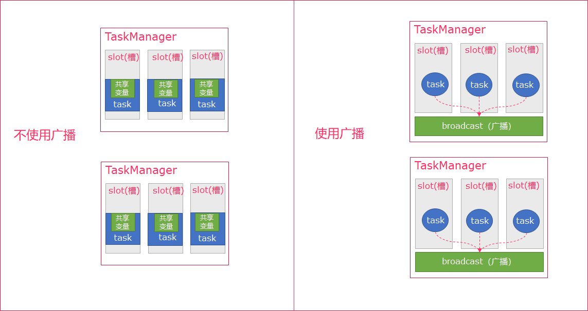

# Flink批处理

## 1. Flink的广播变量


Flink支持广播。可以将数据广播到TaskManager上，数据存储到内存中。数据存储在内存中，这样可以减缓大量的shuffle操作；比如在数据join阶段，不可避免的就是大量的shuffle操作，我们可以把其中一个dataSet广播出去，一直加载到taskManager的内存中，可以直接在内存中拿数据，避免了大量的shuffle，导致集群性能下降；

广播变量创建后，它可以运行在集群中的任何function上，而不需要多次传递给集群节点。另外需要记住，不应该修改广播变量，这样才能确保每个节点获取到的值都是一致的。

一句话解释，可以理解为是一个公共的共享变量，我们可以把一个dataset 数据集广播出去，然后不同的task在节点上都能够获取到，这个数据在每个节点上只会存在一份。如果不使用broadcast，则在每个节点中的每个task中都需要拷贝一份dataset数据集，比较浪费内存(也就是一个节点中可能会存在多份dataset数据)。




* 可以理解广播就是一个公共的共享变量
* 将一个数据集广播后，不同的Task都可以在节点上获取到
* 每个节点`只存一份`
* 如果不使用广播，每一个Task都会拷贝一份数据集，造成内存资源浪费


**用法**

* 在需要使用广播的操作后，使用`withBroadcastSet`创建广播
* 在操作中，使用getRuntimeContext.getBroadcastVariable`[广播数据类型]`(`广播名`)获取广播变量

**操作步骤:**

```scala
1：初始化数据
DataSet<Integer> toBroadcast = env.fromElements(1, 2, 3)
2：广播数据
.withBroadcastSet(toBroadcast, "broadcastSetName");
3：获取数据
Collection<Integer> broadcastSet = getRuntimeContext().getBroadcastVariable("broadcastSetName");
```


**示例**

创建一个`学生`数据集，包含以下数据

```html
|学生ID | 姓名 |
|------|------|
List((1, "张三"), (2, "李四"), (3, "王五"))
```

将该数据，发布到广播。


再创建一个`成绩`数据集， 

```html
|学生ID | 学科 | 成绩 |
|------|------|-----|
List( (1, "语文", 50),(2, "数学", 70), (3, "英文", 86))
```


请通过广播获取到学生姓名，将数据转换为

```html
List( ("张三", "语文", 50),("李四", "数学", 70), ("王五", "英文", 86))
```


**步骤**

1. 获取批处理运行环境
2. 分别创建两个数据集
3. 使用`RichMapFunction`对`成绩`数据集进行map转换
4. 在数据集调用`map`方法后，调用`withBroadcastSet`将`学生`数据集创建广播
5. 实现`RichMapFunction`
   - 将成绩数据(学生ID，学科，成绩) -> (学生姓名，学科，成绩)
   - 重写`open`方法中，获取广播数据
   - 导入`scala.collection.JavaConverters._`隐式转换
   - 将广播数据使用`asScala`转换为Scala集合，再使用toList转换为scala `List`集合
   - 在`map`方法中使用广播进行转换
6. 打印测试

**参考代码**

```scala
package com.itheima.broad

import org.apache.flink.api.common.functions.RichMapFunction
import org.apache.flink.api.scala._
import org.apache.flink.configuration.Configuration

object BroadCast {


  def main(args: Array[String]): Unit = {
    // 1. 获取`ExecutionEnvironment`运行环境
    val env = ExecutionEnvironment.getExecutionEnvironment

    // 1. 分别创建两个数据集
    val studentDataSet: DataSet[(Int, String)] = env.fromCollection(List((1, "张三"), (2, "李四"), (3, "王五")))
    val scoreDataSet: DataSet[(Int, String, Int)] = env.fromCollection(List((1, "语文", 50), (2, "数学", 70), (3, "英文", 86)))

    // 1. 使用`RichMapFunction`对`成绩`数据集进行map转换
    // 将成绩数据(学生ID，学科，成绩) -> (学生姓名，学科，成绩)
    val resultDataSet: DataSet[(String, String, Int)] = scoreDataSet.map(new RichMapFunction[(Int, String, Int), (String, String, Int)] {

      var bc_studentList: List[(Int, String)] = null

      // - 重写`open`方法中，获取广播数据
      override def open(parameters: Configuration): Unit = {
        import scala.collection.JavaConverters._
        bc_studentList = getRuntimeContext.getBroadcastVariable[(Int, String)]("bc_student").asScala.toList
      }

      //   - 在`map`方法中使用广播进行转换
      override def map(value: (Int, String, Int)): (String, String, Int) = {
        // 获取学生ID
        val studentId: Int = value._1
        // 过滤出和学生ID相同的内容
        val tuples: List[(Int, String)] = bc_studentList.filter((x: (Int, String)) => x._1 == studentId)
        // 构建元组
        (tuples(0)._2,value._2,value._3)
      }
    }).withBroadcastSet(studentDataSet, "bc_student")
    
    // 3. 打印测试
    resultDataSet.print()
  }

}
```


> 1. 广播出去的变量存放在每个节点的内存中，直到程序结束，这个数据集不能太大
> 2. `withBroadcastSet`需要在要使用到广播的操作后调用
> 3. 需要手动导入`scala.collection.JavaConverters._`将Java集合转换为scala集合


------


