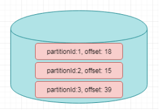

# Flink高级


## 1. Flink的状态管理


### 1.1. 什么是有状态的计算

官网对Flink的解释：**Stateful Computations over Data Streams**，这是说Flink是一个有`xA`的数据流计算框架。

**那什么是有状态的计算？**

计算任务的结果不仅仅依赖于输入，还依赖于它的当前状态，其实大多数的计算都是有状态的计算。

比如wordcount,计算单词的count,这是一个很常见的业务场景。count做为输出，在计算的过程中要不断的把输入累加到count上去，那么count就是一个state。


**传统的流计算系统缺少对于程序状态的有效支持**

- 状态数据的存储和访问；
- 状态数据的备份和恢复；
- 状态数据的划分和动态扩容。

在传统的批处理中，数据是划分为块分片去完成的，然后每一个Task去处理一个分片。当分片执行完成后，把输出聚合起来就是最终的结果。在这个过程当中，对于state的需求还是比较小的。

对于流计算而言，对State有非常高的要求，因为在流系统中输入是一个无限制的流，会运行很长一段时间，甚至运行几天或者几个月都不会停机。在这个过程当中，就需要将状态数据很好的管理起来。很不幸的是，在传统的流计算系统中，对状态管理支持并不是很完善。比如storm,没有任何程序状态的支持，一种可选的方案是storm+hbase这样的方式去实现，把这状态数据存放在Hbase中，计算的时候再次从Hbase读取状态数据，做更新在写入进去。这样就会有如下几个问题

- 流计算系统的任务和Hbase的数据存储有可能不在同一台机器上，导致性能会很差。这样经常会做远端的访问，走网络和存储；

- 备份和恢复是比较困难，因为Hbase是没有回滚的，要做到Exactly once 很困难。在分布式环境下，如果程序出现故障，只能重启Storm，那么Hbase的数据也就无法回滚到之前的状态。
  比如广告计费的这种场景，Storm+Hbase是是行不通的，出现的问题是钱可能就会多算，解决以上的办法是Storm+mysql，通过mysql的回滚解决一致性的问题。但是架构会变得非常复杂。性能也会很差，要commit确保数据的一致性。

- 对于storm而言状态数据的划分和动态扩容也是非常难做。
  一个很严重的问题是所有用户都会在strom上重复的做这些工作，比如搜索，广告都要在做一遍，由此限制了部门的业务发展。

  

**Flink丰富的状态访问和高效的容错机制**

我们前面写的WordCount的例子，没有包含`状态管理`。如果一个Task在处理过程中挂掉了，那么它在内存中的状态都会丢失，所有的数据都需要重新计算。 从容错和消息处理的语义上(at least once, exactly once)，Flink引入了`State`和`Checkpoint`

首先区分一下两个概念:

>   **State: **
>
>   ​	一般指一个具体的Task/Operator的状态，
>
>   ​	State数据默认保存在Java的堆内存中

>   **Checkpoint: **
>
>   ​	表示了一个Flink Job在一个特定时刻的一份全局状态快照，即包含了所有Task/Operator的状态
>
>   ​	可以理解为Checkpoint是把State数据定时持久化存储了，

State可以被记录，在失败的情况下数据还可以恢复

Flink中有两种基本类型的State

-   Keyed State
-   Operator State

可以以两种形式存在：`原始状态`和`托管状态`

托管状态是由Flink框架管理的状态，如ValueState, ListState, MapState等。

而原始状态，由用户自行管理状态具体的数据结构，框架在做checkpoint的时候，使用byte[]来读写状态内容，对其内部数据结构一无所知。

通常在DataStream上的状态推荐使用托管的状态，当实现一个用户自定义的operator时，会使用到原始状态。


### 1.2. Keyed State

顾名思义，就是基于KeyedStream上的状态。这个状态是跟特定的key绑定的，对KeyedStream流上的每一个key，都对应一个state。

stream.keyBy(…)

保存state的数据结构

`ValueState<T>`:即类型为T的`单值`状态。这个状态与对应的key绑定，是最简单的状态了。它可以通过`update`方法更新状态值，通过`value()`方法获取状态值

ListState<T>:即key上的状态值为一个列表。可以通过add方法往列表中附加值；也可以通过get()方法返回一个Iterable<T>来遍历状态值

ReducingState<T>:这种状态通过用户传入的reduceFunction，每次调用add方法添加值的时候，会调用reduceFunction，最后合并到一个单一的状态值

MapState<UK, UV>:即状态值为一个map。用户通过put或putAll方法添加元素

需要注意的是，以上所述的State对象，仅仅用于与状态进行交互（更新、删除、清空等），而真正的状态值，有可能是存在内存、磁盘、或者其他分布式存储系统中。相当于我们只是持有了这个状态的句柄


**官网示例代码**

```scala
import org.apache.flink.api.common.functions.RichFlatMapFunction
import org.apache.flink.api.common.state.{ValueState, ValueStateDescriptor}
import org.apache.flink.configuration.Configuration
import org.apache.flink.streaming.api.scala.StreamExecutionEnvironment
import org.apache.flink.api.scala._
import org.apache.flink.util.Collector

class CountWindowAverage extends RichFlatMapFunction[(Long, Long), (Long, Long)] {

  private var sum: ValueState[(Long, Long)] = _

  override def flatMap(input: (Long, Long), out: Collector[(Long, Long)]): Unit = {

    // access the state value
    val tmpCurrentSum = sum.value

    // If it hasn't been used before, it will be null
    val currentSum = if (tmpCurrentSum != null) {
      tmpCurrentSum
    } else {
      (0L, 0L)
    }

    // update the count
    val newSum = (currentSum._1 + 1, currentSum._2 + input._2)

    // update the state
    sum.update(newSum)

    // if the count reaches 2, emit the average and clear the state
    if (newSum._1 >= 2) {
      out.collect((input._1, newSum._2 / newSum._1))
      sum.clear()
    }
  }

  override def open(parameters: Configuration): Unit = {
    sum = getRuntimeContext.getState(
      new ValueStateDescriptor[(Long, Long)]("average", createTypeInformation[(Long, Long)])
    )
  }
}


object ExampleCountWindowAverage extends App {
  val env = StreamExecutionEnvironment.getExecutionEnvironment

  env.fromCollection(List(
    (1L, 3L),
    (1L, 5L),
    (1L, 7L),
    (1L, 4L),
    (1L, 2L)
  )).keyBy(_._1)
    .flatMap(new CountWindowAverage())
    .print()
  // the printed output will be (1,4) and (1,5)

  env.execute("ExampleManagedState")
}
```


### 1.3. Operator State


- 与Key无关的State，与Operator绑定的state，整个operator`只对应一个`state

- 保存state的数据结构

  - ListState<T>

- 举例来说，Flink中的Kafka Connector，就使用了operator state。它会在每个connector实例中，保存该实例中消费topic的所有(partition, offset)映射





**官网案例**

https://ci.apache.org/projects/flink/flink-docs-release-1.6/dev/stream/state/state.html#using-managed-operator-state


```scala
package com.itheima

import org.apache.flink.api.common.state.{ListState, ListStateDescriptor}
import org.apache.flink.api.common.typeinfo.{TypeHint, TypeInformation}
import org.apache.flink.runtime.state.{FunctionInitializationContext, FunctionSnapshotContext}
import org.apache.flink.streaming.api.checkpoint.CheckpointedFunction
import org.apache.flink.streaming.api.functions.sink.SinkFunction

import scala.collection.mutable.ListBuffer

/**
  * 带缓存的Sink
  *
  * SinkFunction : 自定义Sink的函数
  * CheckpointedFunction: 状态转换函数的核心接口
  * @param threshold    阈值
  */
class BufferingSink(threshold: Int = 0)
  extends SinkFunction[(String, Int)]
    with CheckpointedFunction {

  @transient
  private var checkpointedState: ListState[(String, Int)] = _

  // 缓存对象
  private val bufferedElements = ListBuffer[(String, Int)]()

  override def invoke(value: (String, Int)): Unit = {
    // 累加数据到bufferedElements
    bufferedElements += value

    // 如果bufferedElements累加的大小等于阈值,那么进行sink,并清除数据
    if (bufferedElements.size == threshold) {
      for (element <- bufferedElements) {
        // send it to the sink
      }
      bufferedElements.clear()
    }
  }

  /**
    * 快照State
    * @param context
    */
  override def snapshotState(context: FunctionSnapshotContext): Unit = {
    // 清理下历史State
    checkpointedState.clear()
    // 遍历缓存bufferedElements中的所有数据,会添加到ListState中
    for (element <- bufferedElements) {
      checkpointedState.add(element)
    }
  }

  /**
    * 初始化State
    * @param context
    */
  override def initializeState(context: FunctionInitializationContext): Unit = {
    // 创建ListStateDescriptor
    val descriptor = new ListStateDescriptor[(String, Int)](
      "buffered-elements",
      TypeInformation.of(new TypeHint[(String, Int)]() {})
    )

    // 获取ListState对象
    checkpointedState = context.getOperatorStateStore.getListState(descriptor)

    // 如果是错误恢复状态, 获取ListState对象的值,并且累加到bufferedElements
    if(context.isRestored) {
      for(element <- checkpointedState.get()) {
        bufferedElements += element
      }
    }
  }

}
```


