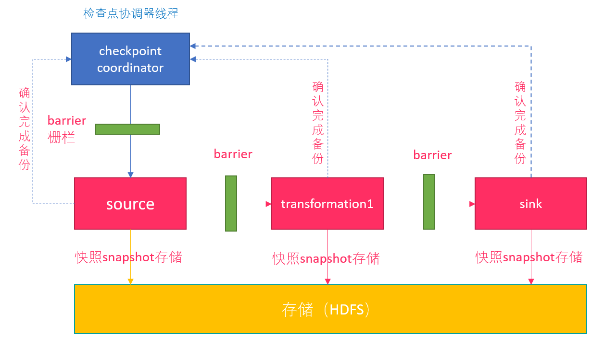

# Flink高级

## 1. Flink的容错

### 1.1. Checkpoint介绍

Checkpoint是Flink容错的核心机制。它可以定期地将各个Operator处理的数据进行快照存储（`Snapshot`）。如果Flink程序出现宕机，可以重新从这些快照中恢复数据。

每个需要Checkpoint的应用在启动时，Flink的JobManager为其创建一个 `CheckpointCoordinator`(检查点协调器)，CheckpointCoordinator全权负责本应用的快照制作。 



1.  `CheckpointCoordinator`周期性的向该流应用的所有`Source`算子发送`Barrier`。 

2.  当某个Source算子收到一个barrier时，便`暂停`数据处理过程，然后将自己的当前状态制作成`快照`，并保存到指定的持久化存储中，最后向CheckpointCoordinator报告自己快照制作情况，同时向自身所有下游算子广播该Barrier，恢复数据处理 

3.  下游算子收到Barrier之后，会暂停自己的数据处理过程，然后将自身的相关状态制作成快照，并保存到指定的持久化存储中，最后向CheckpointCoordinator报告自身快照情况，同时向自身所有下游算子广播该Barrier，恢复数据处理。 

4.  每个算子按照步骤3不断制作快照并向下游广播，直到`最后Barrier`传递到`Sink算子`，快照制作完成。 

5.  当CheckpointCoordinator收到所有算子的报告之后，认为该周期的快照制作成功; 否则，如果在规定的时间内没有收到所有算子的报告，则认为本周期快照制作失败 


**单流的Barrier**

Flink 分布式快照的核心概念之一就是`数据栅栏（barrier）`。

- 这些 barrier 被插入到数据流中，作为数据流的一部分和数据一起向下流动。

- Barrier 不会干扰正常数据，`数据流严格有序`。Barrier 永远不会赶超通常的流记录，它会严格遵循顺序。
- 一个 barrier 把数据流分割成两部分：一部分进入到当前快照，另一部分进入下一个快照。
- 每一个 barrier 都带有快照 ID，并且 barrier 之前的数据都进入了此快照。
- Barrier 不会干扰数据流处理，所以非常轻量。
- 多个不同快照的多个 barrier 会在流中同时出现，即多个快照可能同时创建。


**并行Barrier**


当Operator接收到`多个`输入的数据流时，需要在Snapshot Barrier中对数据流进行`排列对齐`：

1. Operator从一个incoming Stream接收到Snapshot Barrier n，然后`暂停`处理，直到其它的incoming Stream的Barrier n（否则属于2个Snapshot的记录就混在一起了）到达该Operator
2. 接收到Barrier n的Stream被临时搁置，来自这些Stream的记录不会被处理，而是被放在一个Buffer中。
3. 一旦最后一个Stream接收到Barrier n，Operator会emit所有暂存在Buffer中的记录，然后向Checkpoint Coordinator发送Snapshot n。
4. 继续处理来自多个Stream的记录


>    基于Stream Aligning操作能够实现Exactly Once语义，但是也会给流处理应用带来延迟，因为为了排列对齐Barrier，会暂时缓存一部分Stream的记录到Buffer中，尤其是在数据流并行度很高的场景下可能更加明显，通常以最迟对齐Barrier的一个Stream为处理Buffer中缓存记录的时刻点。在Flink中，提供了一个开关，选择是否使用Stream Aligning，如果关掉则Exactly Once会变成At least once。


### 1.2. Checkpoint持久化

目前，Checkpoint持久化存储可以使用如下三种: 

-   MemoryStateBackend

-   FsStateBackend

-   RocksDBStateBackend

#### 1.2.1. MemoryStateBackend

`MemoryStateBackend` 是将状态维护在 Java 堆上的一个内部状态后端。键值状态和窗口算子使用哈希表来存储数据（values）和定时器（timers）。当应用程序 checkpoint 时，此后端会在将状态发给 JobManager 之前快照下状态，JobManager 也将状态存储在 Java 堆上。默认情况下，MemoryStateBackend 配置成支持异步快照。异步快照可以避免阻塞数据流的处理，从而避免反压的发生。

使用 MemoryStateBackend 时的注意点：

- 默认情况下，每一个状态的大小限制为 5 MB。可以通过 MemoryStateBackend 的构造函数增加这个大小。
- 状态大小受到 akka 帧大小的限制，所以无论怎么调整状态大小配置，都不能大于 akka 的帧大小。
- 状态的总大小不能超过 JobManager 的内存。

何时使用 MemoryStateBackend：

- 本地开发或调试时建议使用 MemoryStateBackend，因为这种场景的状态大小的是有限的。
- MemoryStateBackend 最适合小状态的应用场景。例如 `Kafka consumer`，或者一次仅一记录的函数 （Map, FlatMap，或 Filter）。

#### 1.2.2. FsStateBackend

该持久化存储主要将快照数据保存到`文件系统`中，目前支持的文件系统主要是 `HDFS`和`本地文件`。如果使用HDFS，则初始化FsStateBackend时，需要传入以 `“hdfs://”`开头的路径(即: new FsStateBackend("hdfs:///hacluster/checkpoint"))， 如果使用本地文件，则需要传入以`“file://”`开头的路径(即:new FsStateBackend("file:///Data"))。在分布式情况下，不推荐使用本地文件。如果某个算子在节点A上失败，在节点B上恢复，使用本地文件时，在B上无法读取节点 A上的数据，导致状态恢复失败。

FsStateBackend适用的场景：

-   适用于处理大状态，长窗口，或大键值状态的有状态处理任务。

-   非常适合用于高可用方案。

#### 1.2.3. RocksDBStateBackend

RocksDBStateBackend 的配置也需要一个文件系统（类型，地址，路径），如下所示：

- “hdfs://namenode:9000/flink/checkpoints” 或
- “file:///flink/checkpoints”

**RocksDB 是一种嵌入式的本地数据库**。RocksDBStateBackend 将处理中的数据使用 RocksDB 存储在本地磁盘上。在 checkpoint 时，整个 RocksDB 数据库会被存储到配置的文件系统中，或者在超大状态作业时可以将增量的数据存储到配置的文件系统中。同时 Flink 会将极少的元数据存储在 JobManager 的内存中，或者在 Zookeeper 中（对于高可用的情况）。RocksDB 默认也是配置成异步快照的模式。


何时使用 RocksDBStateBackend：

- RocksDBStateBackend 最适合用于处理大状态，长窗口，或大键值状态的有状态处理任务。
- RocksDBStateBackend 非常适合用于高可用方案。
- RocksDBStateBackend 是目前唯一支持增量 checkpoint 的后端。增量 checkpoint 非常使用于超大状态的场景。

当使用 RocksDB 时，状态大小只受限于磁盘可用空间的大小。这也使得 RocksDBStateBackend 成为管理超大状态的最佳选择。使用 RocksDB 的权衡点在于所有的状态相关的操作都需要序列化（或反序列化）才能跨越 JNI 边界。与上面提到的堆上后端相比，这可能会影响应用程序的吞吐量。

如果用户使用自定义窗口(window)，不推荐用户使用RocksDBStateBackend。在自定义窗口中，状态以ListState的形式保存在StatBackend中，如果一个key值中有多 个value值，则RocksDB读取该种ListState非常缓慢，影响性能。用户可以根据应用的具体情况选择`FsStateBackend+HDFS`或`RocksStateBackend+HDFS`。


**设置CheckPoint的代码如下:**

```scala
val env = StreamExecutionEnvironment.getExecutionEnvironment
// start a checkpoint every 1000 ms
env.enableCheckpointing(1000)
// advanced options:
// 设置checkpoint的执行模式，最多执行一次或者至少执行一次
env.getCheckpointConfig.setCheckpointingMode(CheckpointingMode.EXACTLY_ONCE)
// 设置checkpoint的超时时间
env.getCheckpointConfig.setCheckpointTimeout(60000)
// 如果在制作快照过程中出现错误，是否让整体任务失败：true是  false不是
env.getCheckpointConfig.setFailOnCheckpointingErrors(false)
//设置同一时间有多少个checkpoint可以同时执行
env.getCheckpointConfig.setMaxConcurrentCheckpoints(1)
```


### 1.3. 修改State Backend


**第一种：单任务调整**

修改当前任务代码

env.setStateBackend(new FsStateBackend("hdfs://namenode:9000/flink/checkpoints"));

或者new MemoryStateBackend()

或者new RocksDBStateBackend(filebackend, true);*需要添加第三方依赖*

 

**第二种：全局调整**

修改flink-conf.yaml

state.backend: filesystem

state.checkpoints.dir: hdfs://namenode:9000/flink/checkpoints

>   注意：state.backend的值可以是下面几种：
>
>   ​	jobmanager(MemoryStateBackend), 
>
>   ​	filesystem(FsStateBackend), 
>
>   ​	rocksdb(RocksDBStateBackend)


### 1.4. 案例

#### 1.4.1. 需求

假定用户需要每隔`1秒`钟需要统计`4秒`中窗口中`数据的量`，然后对统计的结果值进行`checkpoint`处理。

窗口的长度: 4s

窗口的滑动时间: 1s

求数据量的总数

checkpoint的支持

#### 1.4.2. 数据规划

>   使用自定义算子每秒钟产生大约10000条数据。 
>
>   产生的数据为一个四元组(Long，String，String，Integer)—------(id,name,info,count)
>
>   数据经统计后，统计结果打印到终端输出
>
>   打印输出的结果为Long类型的数据 

#### 1.4.3. 开发思路

>   source算子每隔1秒钟发送10000条数据，并注入到Window算子中。
>
>   window算子每隔1秒钟统计一次最近4秒钟内数据数量。
>
>   每隔1秒钟将统计结果打印到终端
>
>   每隔6秒钟触发一次checkpoint，然后将checkpoint的结果保存到HDFS或本地文件中。


#### 1.4.4. 开发步骤

**开发自定义数据源**

 	1. 自定义样例类(id: Long, name: String, info: String, count: Int)
 	2. 自定义数据源,继承RichSourceFunction
 	3. 实现run方法, 每秒钟向流中注入10000个样例类


**开发自定义状态**

 	1. 继承Serializable
 	2. 为总数count提供set和get方法


**开发自定义Window和检查点**

 	1. 继承WindowFunction
 	2. 重写apply方法,对窗口数据进行总数累加
 	3. 继承ListCheckpointed
 	4. 重写snapshotState,制作自定义快照
 	5. 重写restoreState,恢复自定义快照


**开发主业务**

1. 流处理环境

2. 开启checkpoint,间隔时间为6s

3. 设置checkpoint位置

4. 设置处理时间为事件时间

5. 添加数据源

6. 添加水印支持

7. keyby分组

8. 设置滑动窗口,窗口时间为4s

9. 指定自定义窗口

10. 打印结果

11. 执行任务

    

#### 1.4.5. 代码

```scala
package com.itheima

import java.util
import java.util.concurrent.TimeUnit

import org.apache.flink.api.java.tuple.Tuple
import org.apache.flink.runtime.state.filesystem.FsStateBackend
import org.apache.flink.streaming.api.functions.AssignerWithPeriodicWatermarks
import org.apache.flink.streaming.api.{CheckpointingMode, TimeCharacteristic}
import org.apache.flink.streaming.api.functions.source.RichSourceFunction
import org.apache.flink.streaming.api.functions.source.SourceFunction.SourceContext
import org.apache.flink.streaming.api.scala.{DataStream, KeyedStream, StreamExecutionEnvironment, WindowedStream}
import org.apache.flink.streaming.api.watermark.Watermark
import org.apache.flink.streaming.api.windowing.assigners.SlidingEventTimeWindows
import org.apache.flink.streaming.api.windowing.time.Time
import org.apache.flink.api.scala._
import org.apache.flink.streaming.api.checkpoint.ListCheckpointed
import org.apache.flink.streaming.api.scala.function.WindowFunction
import org.apache.flink.streaming.api.windowing.windows.TimeWindow
import org.apache.flink.util.Collector

//样例类-->发送数据形式
case class SEvent(id: Long, name: String, info: String, count: Int)

/**
  * 自定义数据源,继承RichSourceFunction
  * 实现run方法和cancel方法
  */
class SEventSourceWithChk extends RichSourceFunction[SEvent] {
  private var isRunning = true

  // 任务取消时调用
  override def cancel(): Unit = {
    isRunning = false
  }

  // source算子的逻辑，即:每秒钟向流图中注入10000个元组
  override def run(sourceContext: SourceContext[SEvent]): Unit = {
    while (isRunning) {
      for (i <- 0 until 10000) {
        sourceContext.collect(SEvent(1, "hello-" + i, "test-info", 1))
      }
      TimeUnit.SECONDS.sleep(1)
    }
  }
}

/**
  * 该段代码是流图定义代码，具体实现业务流程，另外，代码中窗口的触发时间使 用了event time。
  */
object FlinkEventTimeAPIChkMain {
  def main(args: Array[String]): Unit = {
    // 1. 流处理环境
    val env = StreamExecutionEnvironment.getExecutionEnvironment
    // 2. 开启checkpoint,间隔时间为6s
    env.enableCheckpointing(6000)
    // 3. 设置checkpoint位置
    //    env.setStateBackend(new FsStateBackend("hdfs://node01:9000/flink-checkpoint/checkpoint/"))
    env.setStateBackend(new FsStateBackend("file:///E:/dev_checkpoint/"))
    // 设置checkpoint模式, EXACTLY_ONCE为默认值,这句可以省略
    env.getCheckpointConfig.setCheckpointingMode(CheckpointingMode.EXACTLY_ONCE)
    // 4.设置处理时间为 事件时间
    env.setStreamTimeCharacteristic(TimeCharacteristic.EventTime)
    // 5. 添加数据源
    val source: DataStream[SEvent] = env.addSource(new SEventSourceWithChk)
    // 6. 添加水印支持
    val watermarkDataStream: DataStream[SEvent] = source.assignTimestampsAndWatermarks(new AssignerWithPeriodicWatermarks[SEvent] {
      // 设置watermark
      override def getCurrentWatermark: Watermark = {
        new Watermark(System.currentTimeMillis())
      }
      // 给每个元组打上时间戳
      override def extractTimestamp(t: SEvent, l: Long): Long = {
        System.currentTimeMillis()
      }
    })
    // 7. keyby分组
    val keyedStream: KeyedStream[SEvent, Tuple] = watermarkDataStream.keyBy("id")
    // 8. 设置滑动窗口,窗口时间为4s
    val windowedStream: WindowedStream[SEvent, Tuple, TimeWindow] = keyedStream.timeWindow(Time.seconds(4),Time.seconds(1))
    // 9. 指定自定义窗口
    val result: DataStream[Long] = windowedStream.apply(new WindowStatisticWithChk)
    // 10. 打印结果
    result.print()
    // 11. 执行任务
    env.execute()
  }
}

/**
  * 该数据在算子制作快照时用于保存到目前为止算子记录的数据条数。
  * 用户自定义状态
  */
class UDFState extends Serializable {
  private var count = 0L

  // 设置用户自定义状态
  def setState(s: Long) = count = s

  // 获取用户自定状态
  def getState = count
}

//
/**
  * 该段代码是window算子的代码，每当触发计算时统计窗口中元组数量。
  * 自定义Window,继承WindowFunction
  * WindowFunction[IN, OUT, KEY, W <: Window]
  * ListCheckpointed[UDFState]
  *
  */
class WindowStatisticWithChk extends WindowFunction[SEvent, Long, Tuple, TimeWindow] with ListCheckpointed[UDFState] {
  private var total = 0L


  /**
    * window算子的实现逻辑，即:统计window中元组的数量
    *
    * @param key    keyby的类型
    * @param window 窗口
    * @param input  输入类型
    * @param out    输出类型
    */
  override def apply(key: Tuple, window: TimeWindow, input: Iterable[SEvent], out: Collector[Long]): Unit = {
    var count = 0L
    for (event <- input) {
      count += 1L
    }
    total += count
    out.collect(count)
  }

  /**
    * 从自定义快照中恢复状态
    *
    * @param state
    */
  override def restoreState(state: java.util.List[UDFState]): Unit = {
    val udfState = state.get(0)
    total = udfState.getState
  }

  /**
    * 制作自定义状态快照
    *
    * @param checkpointId 唯一单调递增的数字
    * @param timestamp    master触发checkpoint的时间戳
    * @return
    */
  override def snapshotState(checkpointId: Long, timestamp: Long): java.util.List[UDFState] = {
    val udfList: java.util.ArrayList[UDFState] = new java.util.ArrayList[UDFState]
    val udfState = new UDFState
    udfState.setState(total)
    udfList.add(udfState)
    udfList
  }
}
```


