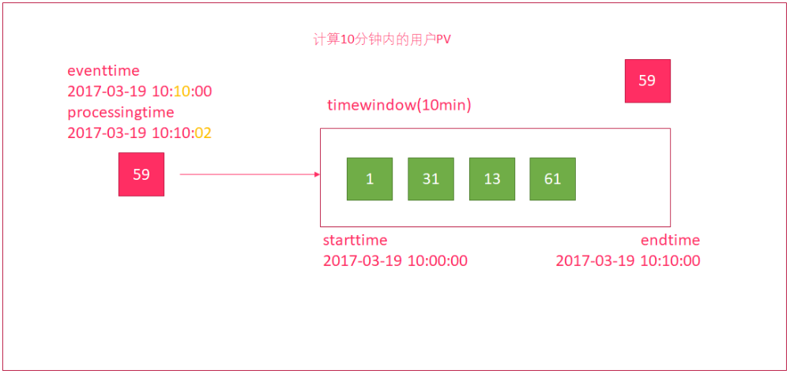

# Flink流处理


## 5. Flink的水印机制

### 5.1. Flink流处理时间方式

- EventTime[事件时间]

  事件发生的时间，例如：点击网站上的某个链接的时间

- IngestionTime[摄入时间]

  某个Flink节点的source operator接收到数据的时间，例如：某个source消费到kafka中的数据

- ProcessingTime[处理时间]

  某个Flink节点执行某个operation的时间，例如：timeWindow接收到数据的时间


设置Flink流处理的时间类型（一般在生产环境中，都是使用EventTime来进行计算的）

```scala
// 设置为按照事件时间来进行计算
env.setStreamTimeCharacteristic(TimeCharacteristic.EventTime)
// 设置为按照处理时间来进行计算
env.setStreamTimeCharacteristic(TimeCharacteristic.ProcessingTime)
```


### 5.2. 水印机制产生的原因

在实际环境中，经常会出现，因为网络原因，数据有可能会`延迟`一会才到达Flink实时处理系统。

我们来设想一下下面这个场景:



1.  使用时间窗口来统计10分钟内的用户流量
2.  有一个时间窗口
    -   开始时间为：2017-03-19 10:00:00
    -   结束时间为：2017-03-19 10:10:00
3.  有一个数据，因为网络延迟
    -   事件发生的时间为：2017-03-19 10:`10`:00
    -   但进入到窗口的时间为：2017-03-19 10:10:`02`，延迟了2秒中
4.  时间窗口并没有将`59`这个数据计算进来，导致数据统计不正确

**这种处理方式，根据消息进入到window时间，来进行计算。在网络有延迟的时候，会引起计算误差。**


### 5.3. 使用水印解决网络延迟问题	

水印（watermark）就是一个`时间戳`，Flink可以给数据流添加水印，可以理解为：收到一条消息后，额外给这个消息添加了一个时间字段，这就是**添加水印**。

-   水印并不会影响原有Eventtime
-   当数据流添加水印后，会按照水印时间来触发窗口计算
-   一般会设置水印时间，比Eventtime小几秒钟
-   当接收到的`水印时间 >= 窗口的endTime`，则触发计算


**示例**

编写代码, 计算5秒内，用户的订单总额

订单数据（订单ID——UUID、用户ID、时间戳、订单金额），要求`添加水印`来解决网络延迟问题。


**步骤**

1.  创建流处理运行环境
2.  设置处理时间为`EventTime`
3.  创建一个订单样例类`Order`，包含四个字段（订单ID、用户ID、订单金额、时间戳）
4.  创建一个自定义数据源
    -   随机生成订单ID（UUID）
    -   随机生成用户ID（0-2）
    -   随机生成订单金额（0-100）
    -   时间戳为当前系统时间
    -   每隔1秒生成一个订单
5.  添加水印
    -   允许延迟2秒
    -   在获取水印方法中，打印水印时间、事件时间和当前系统时间
6.  按照用户进行分流
7.  设置5秒的时间窗口
8.  进行聚合计算
9.  打印结果数据
10.  启动执行流处理


**参考代码**

```scala
 import java.util.UUID
import java.util.concurrent.TimeUnit
import org.apache.commons.lang.time.FastDateFormat
import org.apache.flink.api.scala._
import org.apache.flink.streaming.api.TimeCharacteristic
import org.apache.flink.streaming.api.functions.AssignerWithPeriodicWatermarks
import org.apache.flink.streaming.api.functions.source.{RichSourceFunction, SourceFunction}
import org.apache.flink.streaming.api.scala.{DataStream, StreamExecutionEnvironment}
import org.apache.flink.streaming.api.watermark.Watermark
import org.apache.flink.streaming.api.windowing.time.Time

import scala.util.Random

object WaterMarkDemo {

  // 3. 创建一个订单样例类`Order`，包含四个字段（订单ID、用户ID、订单金额、时间戳）
  case class Order(orderId: String, userId: Int, money: Long, timestamp: Long)

  def main(args: Array[String]): Unit = {
    // 1. 创建流处理运行环境
    val env = StreamExecutionEnvironment.getExecutionEnvironment
    //   2. 设置处理时间为`EventTime`
    env.setStreamTimeCharacteristic(TimeCharacteristic.EventTime)
    // 4. 创建一个自定义数据源
    val orderDataStream: DataStream[Order] = env.addSource(new RichSourceFunction[Order] {
      var isRunning = true

      override def run(ctx: SourceFunction.SourceContext[Order]): Unit = {
        while (isRunning) {
          //   - 随机生成订单ID（UUID）
          // - 随机生成用户ID（0-2）
          // - 随机生成订单金额（0-100）
          // - 时间戳为当前系统时间
          // - 每隔1秒生成一个订单
          val order = Order(UUID.randomUUID().toString, Random.nextInt(3), Random.nextInt(101), new java.util.Date().getTime)
          ctx.collect(order)
          TimeUnit.SECONDS.sleep(1)
        }
      }

      override def cancel(): Unit = isRunning = false
    })
    // 5. 添加水印
    val watermarkDataStream = orderDataStream.assignTimestampsAndWatermarks(new AssignerWithPeriodicWatermarks[Order] {
      var currentTimestamp = 0L
      val delayTime = 2000

      override def getCurrentWatermark: Watermark = {
        //   - 允许延迟2秒
        // - 在获取水印方法中，打印水印时间、当前事件时间和当前系统时间
        val watermark = new Watermark(currentTimestamp - delayTime)
        val dateFormat = FastDateFormat.getInstance("HH:mm:ss")

        println(s"当前水印时间:${dateFormat.format(watermark.getTimestamp)}, 当前事件时间: ${dateFormat.format(currentTimestamp)}, 当前系统时间: ${dateFormat.format(System.currentTimeMillis())}")
        watermark
      }

      override def extractTimestamp(element: Order, previousElementTimestamp: Long): Long = {
        val timestamp = element.timestamp
        currentTimestamp = Math.max(currentTimestamp, timestamp)
        currentTimestamp
      }
    })
    // 6. 按照用户进行分流
    // 7. 设置5秒的时间窗口
    // 8. 进行聚合计算
    // 9. 打印结果数据
    // 10. 启动执行流处理
    watermarkDataStream.keyBy(_.userId)
      .timeWindow(Time.seconds(5))
      .reduce {
        (order1, order2) =>
          Order(order2.orderId, order2.userId, order1.money + order2.money, 0)
      }
      .print()
    env.execute("WarkMarkDemoJob")
  }
}
```

